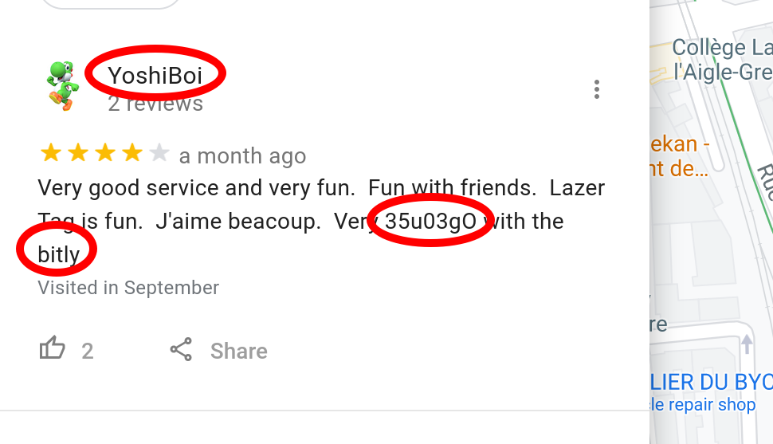
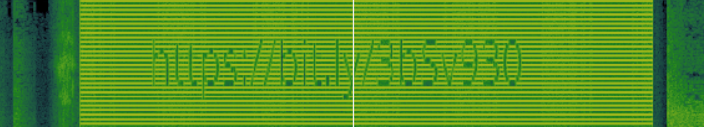
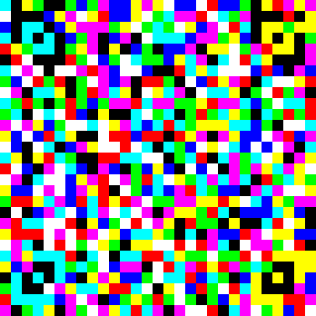

# Around the World

 

```txt
Thank you for narrowing down the unF0r7un@t3s base of operations in "Hash Browns". We figured out that the password was the city and zip code of where they would be located. We have noticed a high level of suspicious activity near the “Laser Game Evolution Grenoble”. Please look into this location’s details. You may want to interview people who have been there before, and ask them if they had noticed anything strange.

- YoshiBoi#2008
```

---

Like the challenge title suggests, this challenge involves many steps ^^ - you virtually "travel around the world".

First of all, take a look at the Google Maps location included in the task statement. ([Laser Game Evolution Grenoble](https://www.google.com/maps/place/Laser+Game+Evolution+Grenoble/@45.1807256,5.7201182,17.21z/data=!4m5!3m4!1s0x0:0x382f2e8c712550fd!8m2!3d45.1814092!4d5.7208863)).

Here, you can find a review written by a user with a familiar username ^^:



... plus, a couple of interesting phrases: `bitly` and `35u03gO` - this can be formatted to form this URL: [https://bit.ly/35u03g0](https://bit.ly/35u03g0).

Once you have opened it, you'll see that you've been redirected to a Google Docs document with the following contents:

```txt
00110110 00110010 00100000 00110110 00111001 00100000 00110111 00110100 00100000 00110010 01100101 00100000 00110110 01100011 00100000 00110111 00111001 00100000 00110010 01100110 00100000 00110011 00110011 00100000 00110110 01100100 00100000 00110110 00110111 00100000 00110111 01100001 00100000 00110100 00110010 00100000 00110110 00110111 00100000 00110101 00110001
```

... _hmmm_... simply paste it into cyberchef; apply `from binary -> from hex` and find the next `bit.ly` URL: [https://bit.ly/3mgzBgQ](bit.ly/3mgzBgQ).

Once you open this one, you'll get the file `run.mp3`. A look at the spectrogram in something like `Audacity` will give you the next URL ^^:



... now... open [https://bit.ly/3bSv930](https://bit.ly/3bSv930) and you'll find the second-last step of the challenge ^^ - the following image `jabby.png`:



... from previous CTFs and from the image's title we knew that this was a `JAB` code. You can simply google and find an online scanner such as [jabcode.org](https://jabcode.org/scan/). The image's content turned out to be:

```txt
Q1lDVEZ7dzB3X3kwdV9yMzRsbHlfckBuX2FyMHVuZF9AX2wwdF90MF9mIW5kX20zfSBOb3cgdGhhdCB5b3UncmUgaGVyZSwgbWlnaHQgYXMgd2VsbCBjaGVjayBvdXQgdGhpcyBhd2Vzb21lIGxpbms6IGh0dHBzOi8vYml0bHkuY29tLzk4SzhlSA==
```

... which, once you base64 decode it finally gives you the flag (+ a rick-roll, lol ^^):

```txt
CYCTF{w0w_y0u_r34lly_r@n_ar0und_@_l0t_t0_f!nd_m3} Now that you're here, might as well check out this awesome link: https://bitly.com/98K8eH
```

... now all that was left to do, was to submit: `CYCTF{w0w_y0u_r34lly_r@n_ar0und_@_l0t_t0_f!nd_m3}`
