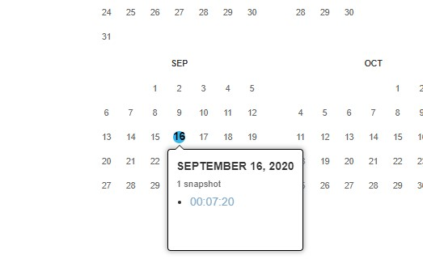
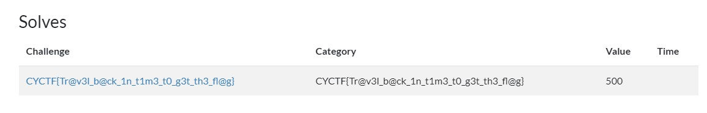

# Back to the Future IV

 

```txt
I thought I got some points, but they got deleted. Can you find them?
- stephencurry396#4738
```

---

The description suggests, that we need to use [Wayback Machine](https://archive.org/web/). There we put in the [Cyberyoddha](https://cyberyoddha.baycyber.net/) link. There you can find an entry of September, 16th



When you look around, you will find a Team, that solved a Challenge, which seems like a flag:




`CYCTF{Tr@v3l_b@ck_1n_t1m3_t0_g3t_th3_fl@g}`