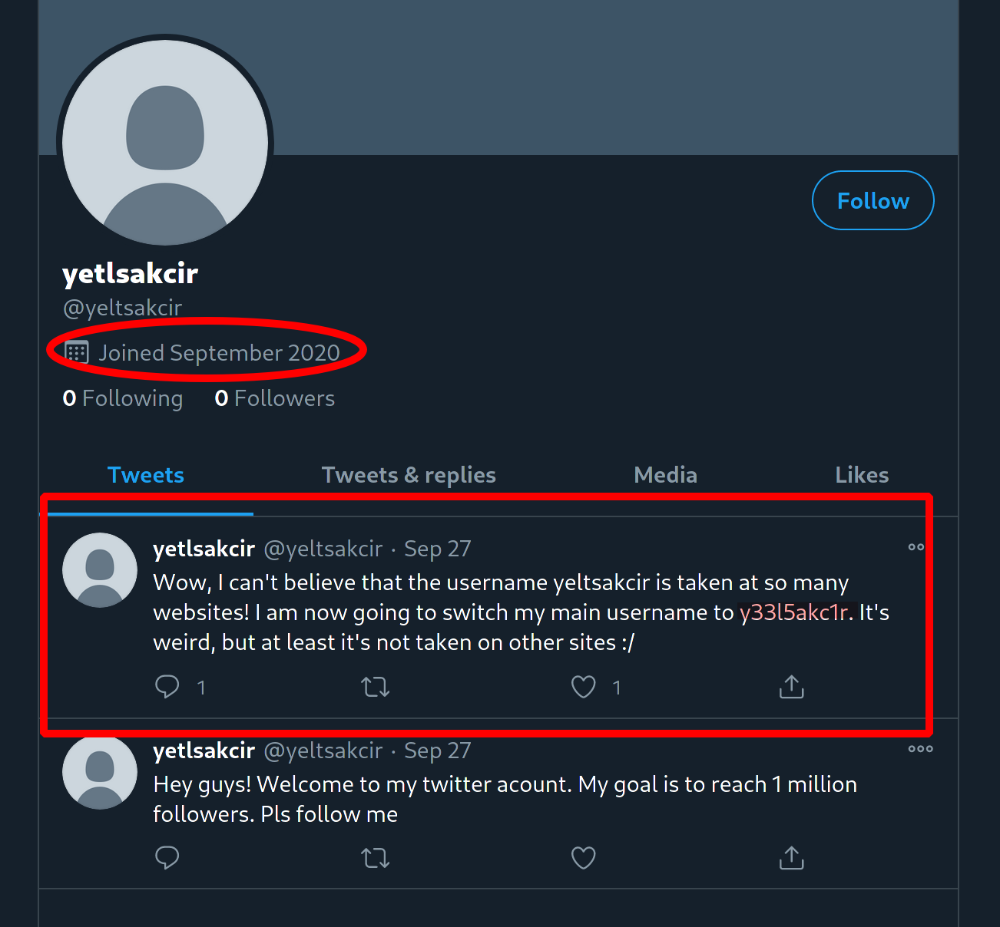
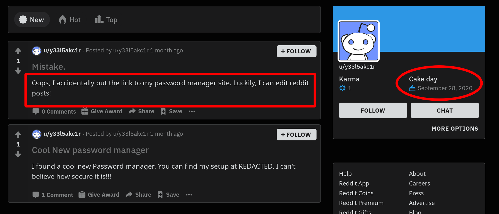
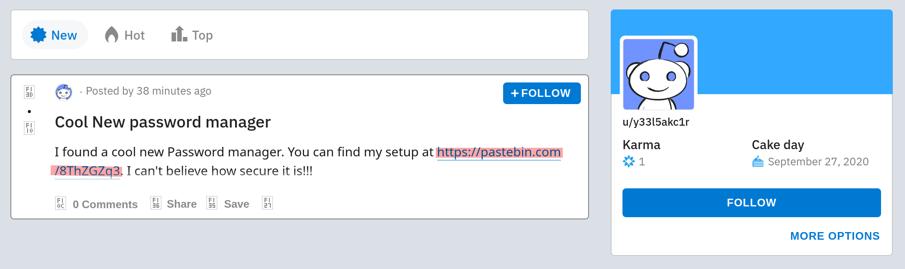
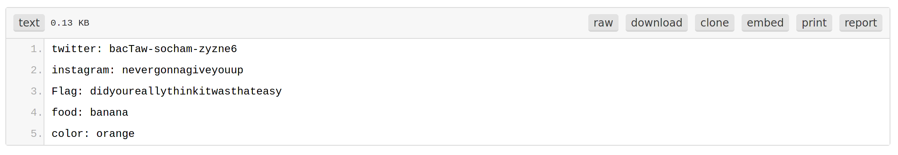

# Flag Storage 3

 

```txt
Yeltsa Kcir is back at it again. He made us a website to store flags, and he said that he stored a demo flag in there. He said if you had any questions to contact him at yeltsakcir@gmail.com, and he mentioned that he liked to reuse passwords, whatever that means. Anyways, can you get the flag?

https://flag-storage-3.web.app

stephencurry396#4738
```

---

After digging through some previous password dumps containing the email address `yeltsakcir@gmail.com`, but not finding any correct passwords... We focused on the username instead.

So... we fired up [sherlock](https://github.com/sherlock-project/sherlock) and took a look at some of the results:

```bash
python sherlock yeltsakcir
```

```txt
[*] Checking username yeltsakcir on:
[+] Archive.org: https://archive.org/details/@yeltsakcir
[+] EyeEm: https://www.eyeem.com/u/yeltsakcir
[+] Lolchess: https://lolchess.gg/profile/na/yeltsakcir
[+] Medium: https://medium.com/@yeltsakcir
...
[+] Twitter: https://mobile.twitter.com/yeltsakcir
[+] VirusTotal: https://www.virustotal.com/ui/users/yeltsakcir/trusted_users
[+] Wattpad: https://www.wattpad.com/user/yeltsakcir
[+] YouTube: https://www.youtube.com/yeltsakcir
```

... we dug through a couple of them... but ... the most interesting one was definitely the [Twitter](https://mobile.twitter.com/yeltsakcir) account. 



... since the user joined in September 2020, it seemed like this was the right account ^^. Furthermore, the last tweet was quite interesting, since it contained a new username: `y33l5akc1r` ... so... back to `sherlock` we went ^^

```txt
[*] Checking username y33l5akc1r on:
[+] EyeEm: https://www.eyeem.com/u/y33l5akc1r
[+] Facebook: https://www.facebook.com/y33l5akc1r
[+] Instagram: https://www.instagram.com/y33l5akc1r
...
[+] Reddit: https://www.reddit.com/user/y33l5akc1r
[+] Tinder: https://www.gotinder.com/@y33l5akc1r
[+] VirusTotal: https://www.virustotal.com/ui/users/y33l5akc1r/trusted_users
[+] Wattpad: https://www.wattpad.com/user/y33l5akc1r
```

... this time [Reddit](https://www.reddit.com/user/y33l5akc1r) seemed to be the most promising ... especially since the user's cake day seemed about right and the last post is talking about the user leaking some of his passwords ...



... this sounds like the perfect time to make use of the [Wayback Machine](https://web.archive.org/). And indeed! There were a couple of snapshots of this reddit page from the 27th and 28th of September. 



... hey! That looks promising! And... after checking out the [paste](https://pastebin.com/8ThZGZq3)... we got the user's password:



... after sending this to the admins (since the challenge was broken at the time ... ^^), we were rewarded with the flag: `CYCTF{1_gu3$$_p@st3bin_1snt_s3cur3}`
