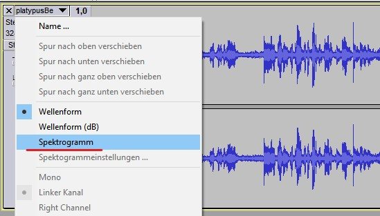
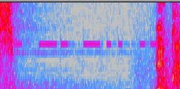
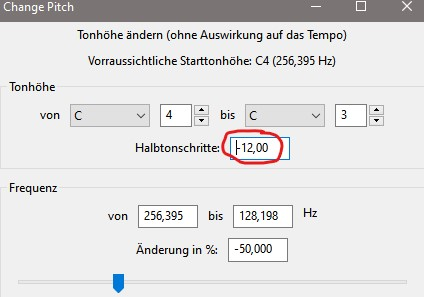
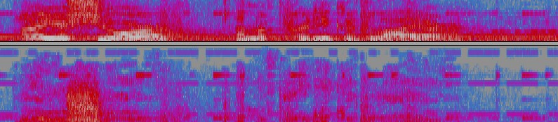

# I'm Not Lying

 

```txt
Our field agents had captured someone who we had suspected to have information about a flag. The recording of their conversation is attached below.

- YoshiBoi#2008
```

---

When listening to the .mp3, we can notice some Morse Code beeping at around 12 seconds.

Opening it in Audacity and switching to Spectrogram View revealed some Morse Code:





So where is the rest of it? - Navigate to "Effects->Change Pitch" => set `-12` for semitones



Now there is a more or less clearly visible Morse Code pattern:



`-.-. -.-- -.-. - ..-. - .-. ..- --... .... ..--.- .... .---- -.. -.. ...-- -. ..--.- ..- -. -.. ...-- .-. ..--.- .-.. -.-.-- . ...-..-`

Using [CyberChef](https://gchq.github.io/CyberChef/) => cyctftru7h_h1dd3n_und3r_l!e$


`cyctf{tru7h_h1dd3n_und3r_l!e$}`

