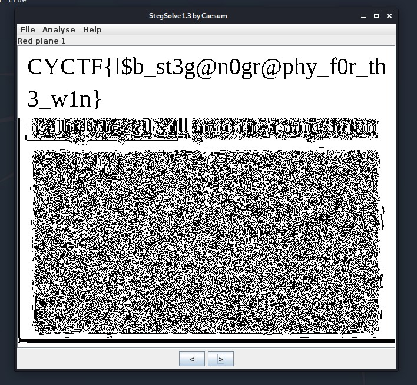

# Steg2

 

```txt
Where's the pizza?
- stephencurry396#4738
```

---


The first instinct, when seeing such challenge, is to open stegsolve and just going through the different planes.

`Red/Green/Blue Plane 1` then showed this:




`CYCTF{l$b_st3g@n0gr@phy_f0r_th3_w1n}`