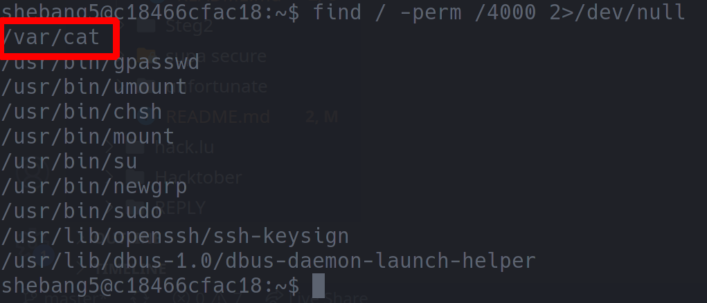

# shebang5

 

```txt
there is a very bad file on this Server. can yoU fInD it.

- stephencurry396#4738
```

---

The description hints at the linux `uid` having some relevance here... Perhaps a binary using `setuid`? ... Let's check it out:

```bash
find / -perm /4000 2>/dev/null
```



... _hmm_ ... this one doesn't look right... `/var/cat` is definitely not a default linux binary... from the name we concluded that it could probably be used to print a file's contents to the terminal... but what file do we want to print?

... after doing some searching ... we figured out that SSH user's passwords were all stored in the directory `/etc/passwords` ... including one of a user that didn't even have a challenge - coincidentally that was the same user that owns the `/var/cat` binary...

With this info, you are able to get the flag. Simply use ...

```bash
/var/cat /etc/passwords/shebang6
```

... _tadaa_... the flag is: `CYCTF{W3ll_1_gu3$$_SU1D_1$_e@$y_fl@g$}`
