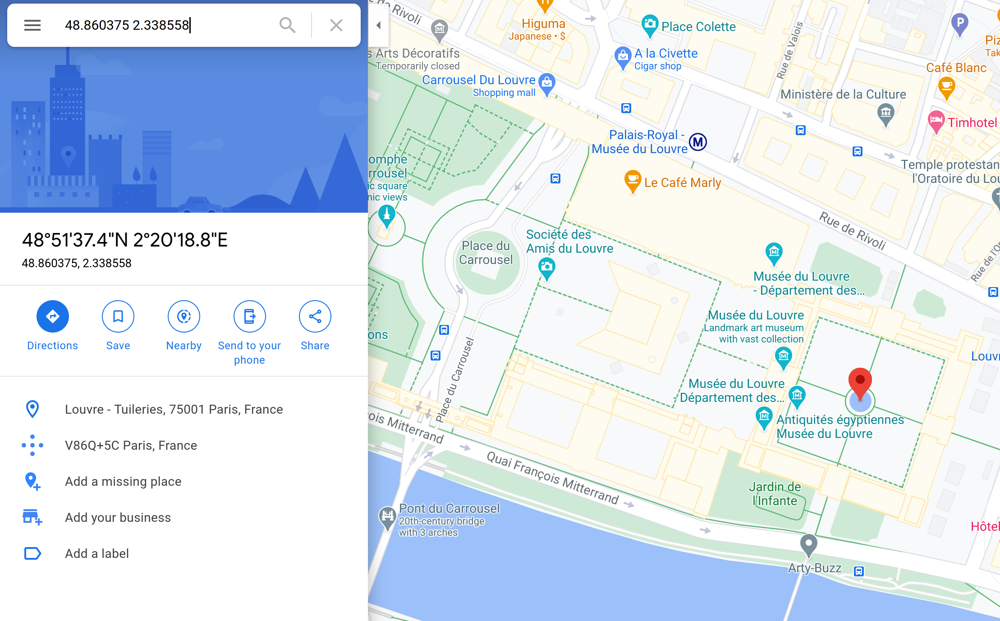

# (un)F0r7un@t3

 

```txt
Three of our best agents: Ron, Adi, and Leonard, were investigating the notorious hacker group known as the unF0r7un@t3s. Fortunately, one of their members dropped a fortune cookie behind from their last scandal. We believe it might be a clue to where they will attack next. The fortune inside read: You will find your fortune at 23441987, 31018357. The lucky numbers on the back were, n52035749, e101, and *10^-6. What location do you think they will be heading to next?

NOTE: No wrapper is necessary for this problem.

- YoshiBoi#2008
```

---

Ok... several hints in the task description ^^. First of all, the names of the best agents `Ron`, `Adi` and `Leonard`, coincidentally are the firstnames of the authors of the _RSA_ crypto system. Also the names of the parameters: `n` and `e` also exist in _RSA_.

So... considering this, we concluded that the first step of getting the flag was cracking the encrypted RSA.

You can simply use [RSACtfTool](https://github.com/Ganapati/RsaCtfTool) for this:

```bash
python27 RsaCtfTool.py -e101 -n52035749 --uncipher 23441987
```

```txt
Unciphered data :
HEX : 0x02e98cd7
INT (big endian) : 48860375
INT (little endian) : 3616336130
STR : b'\x02\xe9\x8c\xd7'
```

```bash
python27 RsaCtfTool.py -e101 -n52035749 --uncipher 31018357
```

```txt
Unciphered data :
HEX : 0x23aefe
INT (big endian) : 2338558
INT (little endian) : 16690723
STR : b'#\xae\xfe'
HEX : 0x0023aefe
INT (big endian) : 2338558
INT (little endian) : 4272825088
STR : b'\x00#\xae\xfe'
```

... all that was left to do now, was to take the `INT (big endian)` results, divide them by the last lucky number, and enter the resulting GPS coordinates on Google Maps:



... the flag therefore was: `Louvre`
