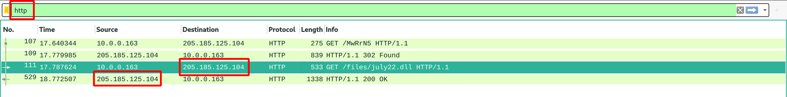

# An Evil Christmas Carol 1

 

```txt
A malicious dll was downloaded over http in this traffic, what was the ip address that delivered this file?

file: https://tinyurl.com/y259doyq
SHA1: 7659667a17bca60310043014ad7971130780cbc1
Password: hacktober
```

---

Pretty much the same as in both other entry-level traffic analysis challenges: Just filter for HTTP traffic!



... as this will (at least in this case) already present you with the flag: `flag{205.185.125.104}`