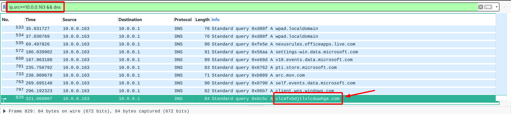

# An Evil Christmas Carol 2

 

```txt
What is the domain used by the post-infection traffic over HTTPS?
Use the file from An Evil Christmas Carol.
```

---

_This challenge is **very** similar to [`Remotely Administrated Evil 2`](../Remotely%20Administrated%20Evil%202/README.md), so I suggest you take a look at that first!_

From the last stage of this challenge, you still have the IP address of the _infected client_ (`10.0.0.163`). Now, simply look at all DNS queries this client has made:



... one should really stick out! This is already the flag: `flag{vlcafxbdjtlvlcduwhga.com}`