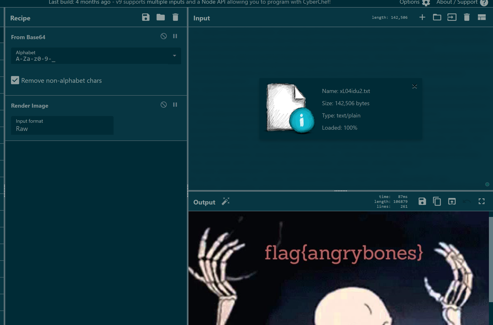

# Bone to Pick

 

```txt
We intercepted network traffic between two suspected DEADFACE actors.  The problem is, we have no idea what we're looking at. We think it might have critical information.  See if you can find the critical information from the link below and submit the flag.

link: https://pastebin.com/xL04idu2
```

---

... a very fun challenge that simply proves the incredible capabilities of crypto tools like [`CyberChef`](https://gchq.github.io/CyberChef/).

Simply open the link from the task description, use it as input for _CyberChef_ and let the magic happen:



... the flag eventually was: `flag{angrybones}`
