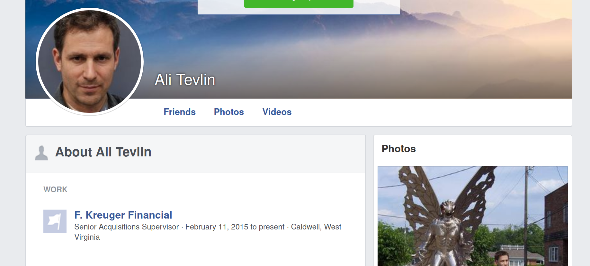

# Creeping 1

 

```txt
Ali Tevlin is quite active on Ghost Town and we believe he's behind some of the recent attacks on De Monne Financial. See what you can find out about him on the internet - it might give us an idea about why he's targeting De Monne Financial.
What company does Ali Tevlin work for? Submit the flag in this format: flag{Little Shop of Horrors}
```

---

Simply searching for `"Ali Tevlin"` on Google and looking precisely at the results will lead you to what looks like [Ali's personal facebook page](https://www.facebook.com/ali.tevlin.5).

Here, you can clearly see that he is currently working at `F. Kreuger Financial`.



The flag therefore is: `flag{F. Kreuger Financial}`
