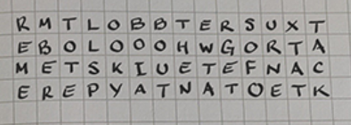

# Down the Wrong Path

 

```txt
One of our operatives took a photo of a notebook belonging to Donnell.  We think it's a message intended for another member of DEADFACE.  Can you decipher the message and tell us who it's intended for?

file: https://tinyurl.com/y8et93u3
SHA1: 0866977ecb74b039d40886cb5a05a259d28e3773
```

---

The link led to a photo of a notebook containing a lot of random _notes_ (who would've thought, right?), plus, some very interesting "text" ...



... after a very long time of us trying out different transposition ciphers (_Rail Fence Cipher_, _Scytale_, ...) ... we figured out the solution to the problem was actually way simpler.

Take another look at the _ciphertext_:

```txt
R M T L O B B T E R S U X T
E B O L O O O H W G O R T A
M E T S K I U E T E F N A C
E R E P Y A T N A T O E T K
```

... do you notice anything? ... no? Well... the solution simply required you to read this jumbled text column by column - resulting in the following plaintext:

```txt
REMEMBER TO TELL SPOOKYBOI ABOUT THE NEW TARGETS OF OUR NEXT ATTACK
```

... the flag therefore was: `flag{spookyboi}`
