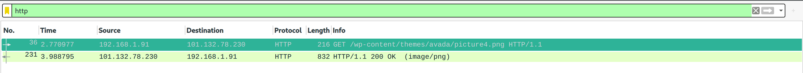
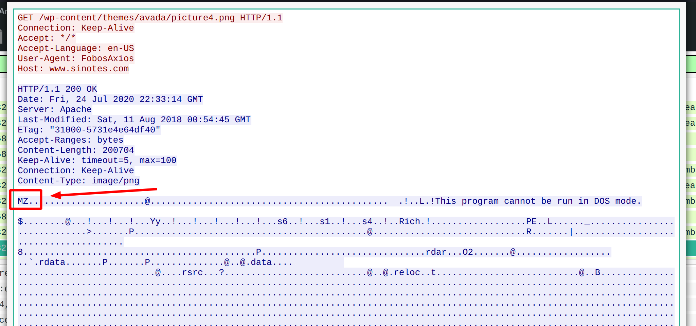
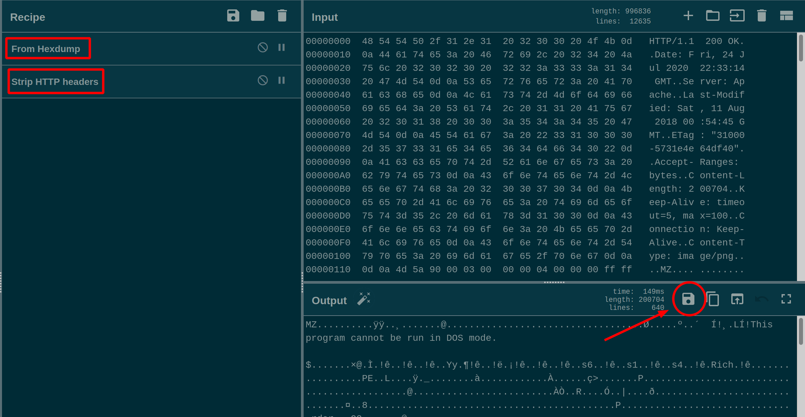

# Evil Corp's Child 1

 

```txt
What is the MD5 hash of the Windows executable file?

NOTE: If you extract any files within this challenge, please delete the file after you have completed the challenge.

link: https://tinyurl.com/y3oltdh5
password: hacktober
```

---

Ok! The first `Traffic Analysis` challenge. This one was still pretty easy to solve.

First of all, simply open Wireshark with the binary you extracted from the downloaded zip file. Now... in my opinion, a good starting point is filtering for only HTTP traffic at first... so... that's what we did:



Well... not too much happening here... Let's have a look at the "png" nontheless _(right click on the HTTP packet -> follow -> TCP Stream)_:



Hmm... that sure is interesting... I could swear I have seen this magic before, but not for PNG images... ^^

Both these magic bytes and the text string _"This program cannot be run in DOS mode."_ make it pretty clear that this is in fact a _PE32_ executable and not a PNG image.

Now... we did have some trouble extracting the file at first, however. So... we decided to simply copy the hexdump, paste it into [CyberChef](https://gchq.github.io/CyberChef) and let it strip away the HTTP headers for us ^^.



All that was left to do, was to download this binary and compute its MD5 checksum - so that's what we did:

```bash
md5sum out.exe
```

... and _tadaa_, the flag eventually turned out to be:
`flag{a95d24937acb3420ee94493db298b295}`