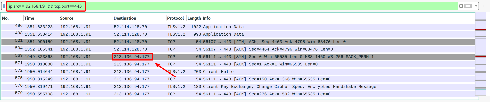

# Evil Corp's Child 2

 

```txt
The malware uses four different ip addresses and ports for communication, what IP uses the same port as https?  Submit the flag as: flag{ip address}.

Use the file from Evil Corp's Child.
```

---

Ok! Challenge number two in the `Evil Corp's Child` series. This time it wasn't about the malicious binary itself, but about the ips used for communication.

Looking back at [`Evil Corp's Child 1`](../Evil%20Corp's%20Child%201/README.md), we know that the _infected client_ has the IP `192.168.1.91`. We also know that HTTPS uses port `443` - so, we can simply construct a Wireshark query with these two parameters:



... and... _tadaa_... while multiple IP addresses appear, you can simply try all of them, to discover that it's the last one, the task statement is referring to ^^.

The flag therefore is: `flag{213.136.94.177}`