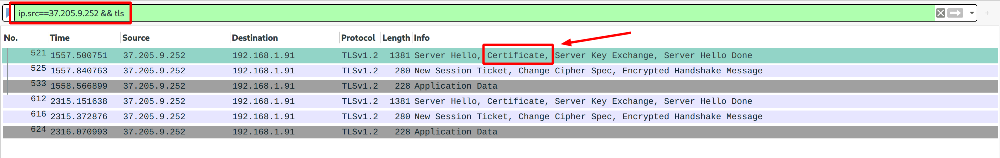
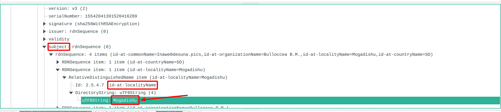

# Evil Corp's Child 3

 

```txt
What is the localityName in the Certificate Issuer data for HTTPS traffic to 37.205.9.252?

Use the file from Evil Corp's Child.
```

---

Well... given the task statement, we know we're looking for `TLS` traffic _(`TLS - Transport Layer Security` is used to encrypt HTTP traffic resulting in HTTPS - HTTP Secure)_ with a source IP address of `37.205.9.252` - since the certificate is usually sent from the server to the client and not the other way around ^^.

Given this info, we can simply construct yet another Wireshark query:



... and ... we have a match! The first data packet already seems to contain a certificate! Now... simply inspect it... and find the locality:



... you have to open quite many submenus until you arrive at the locality... but ... eventually you should find it and get the flag: `flag{Mogadishu}`