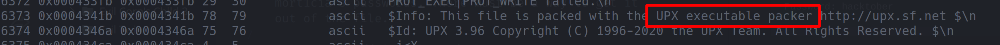
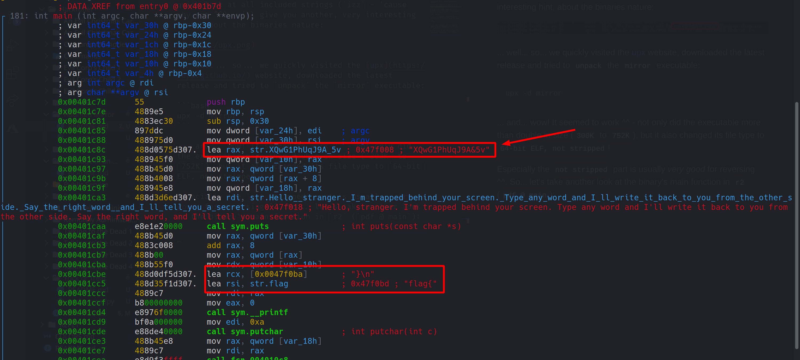

# Haunted Mirror

 

```txt
We found a script being used by DEADFACE. One of our informants says that the code contains one of mort1cia's passwords. There must be a way to get it out of the file.

file: https://tinyurl.com/y5l7932y
SHA1: db5438f4c041520e85f483fd028d6c269215c992
Password: hacktober
```

---

This was one of the more interesting `Programming` challenges.

First of all, a simple `file` command will tell you that the task's executable is a `64-bit ELF binary with no section header`. 

After that, simply opening `radare2` and taking a quick look at all included strings (`izz` - 'cause why not ^^), will give you another, very interesting hint, about the binaries nature:



... well... so... we quickly visited the [upx](https://upx.github.io/) website, downloaded the latest release and tried to `unpack` the `mirror` executable:

```bash
upx -d mirror
```

... and... wow! It seemed to work ^^ - not only did the executable more than double in size (`300K` to `752K`), but it also changed its file type to `64-bit ELF, not stripped`!

Especially the `not stripped` part is usually _very good_ for reversing ^^. So... let's take another look at the binary's main function in `r2` (`pdf @ main`):



... well... well... well... _look what we have here_! Not only does the binary seem to be constructing some `flag{`, `}\n` string - but this long, weird string near the beginning of the function really sticks out as well...

Could this by any chance be `mort1cia`'s password? As it turns out, it seems to be! The flag therefore is: `flag{XQwG1PhUqJ9A&5v}`

**P.S.:** By reading through other writeups after the CTF had already ended, we realized that apparently one could have used a _format string exploit_ (in this case, literally just passing `%s%s%s` as a first argument) to achieve the same thing, without unpacking and reversing the binary.

Still... we prefer this method ^^ it seems more ... _legit_.