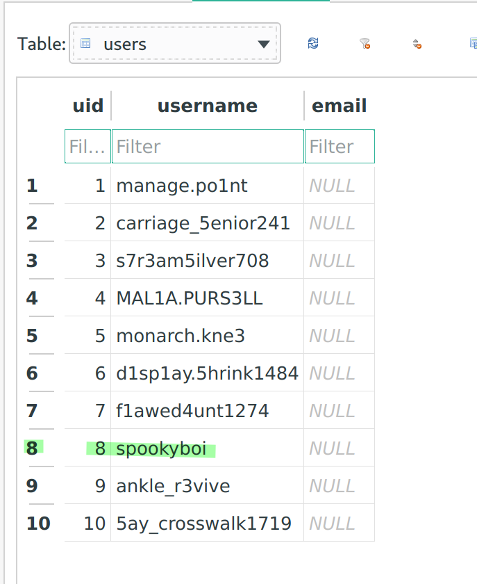
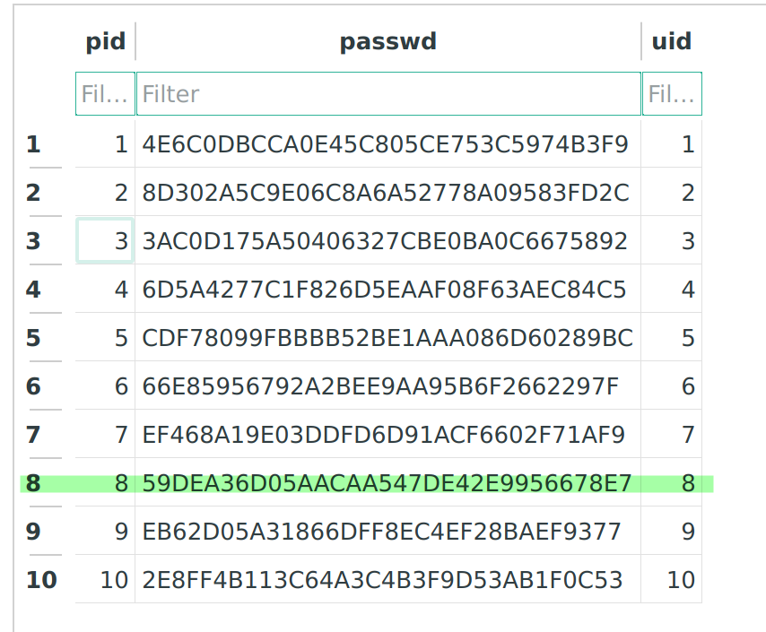
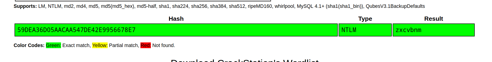

# Past Demons

 

```txt
We've had a hard time finding anything on spookyboi. But finally, with some search engine finessing, an analyst found an old, vulnerable server spookyboi used to run. We extracted a database, now we need your help finding the password. Submit the password as the flag: flag{password}.

link: https://tinyurl.com/y6ssrrcg
password for zip: hacktober
```

---

... inside the ZIP file provided in the challenge description, there is an SQLite DB. Open this in a tool like `sqlitebrowser` (or just `sqlite3`, if you want to).

Now, take a look at the `users` table. Find the user `spookyboi`:



... note that it has the userid `8`. Now, take a look at the `passwd` table and find the corresponding password hash:



... this wasn't quite it though. You have to crack the hash still! Using something like [crackstation](https://crackstation.net) this shouldn't be too difficult, however.



... and, _tadaa_, look at that! A match! We successfully recovered `spookyboi`'s password. The flag therefore is: `flag{zxcvbnm}`
