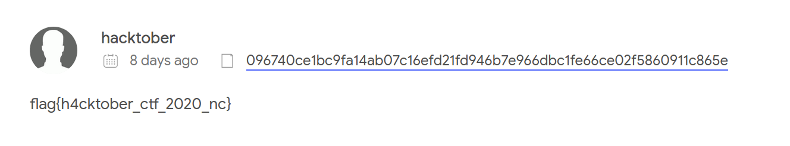

# Public Service

 

```txt
There is a flag associated with the malicious process from Evil Twin on a popular site used to check malware hashes. Find and submit that flag.
```

---

The task description is hinting at "[...] a popular site used to check malware hashes. [...]". That could only mean [virustotal.com](https://virustotal.com).

So... we quickly dumped the [previously discovered](../Evil%20Twin/README.md) _evil twin_ to disk: 

```bash
python2.7 vol.py -f mem.raw --profile=Win10x64_15063 procdump -p 5448 -D dump
```

... and uploaded it to virustotal. ([this](https://www.virustotal.com/gui/file/096740ce1bc9fa14ab07c16efd21fd946b7e966dbc1fe66ce02f5860911c865e/detection) is the URL, btw.).

Now, the task description also talks about a flag being associated with this binary on this popular website... this is probably meant in the sense of some user comment. So... check the community tab and... here you'll find the flag: `flag{h4cktober_ctf_2020_nc}`

