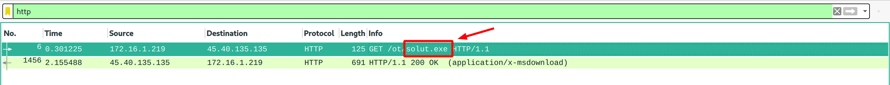

# Remotely Administrated Evil 1

 

```txt
What is the name of the executable in the malicious url? Submit the filename as the flag: flag{virus.bad}.

file: https://tinyurl.com/y4z72k5o
SHA1: 0416385659fc307272b3494df067f6fa2ecc937437a24a75af7c86b666bce139 Password: hacktober
```

---

Essentially the same applies as for [`Evil Corp's Child 1`](../Evil%20Corp's%20Child%201/README.md). Apply a simple filter for HTTP traffic and, in this case, it will actually already be enough to give you the first flag:



... the flag is: `flag{solut.exe}`