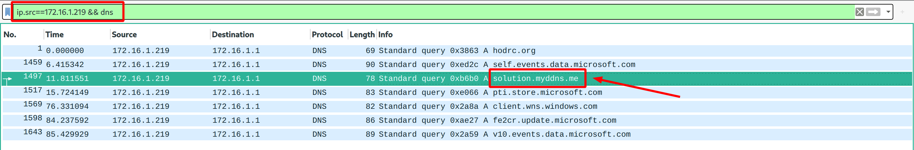

# Remotely Administrated Evil 2

 

```txt
What MYDDNS domain is used for the post-infection traffic in RATPack.pcap?
Use the file from Remotely Administrated Evil.
```

---

If you have already solved [`Remotely Administrated Evil 1`](../Remotely%20Administrated%20Evil%201/README.md), then this one shouldn't be too hard either.

You can simply take the IP address of the infected PC you discovered in the last challenge (`172.16.1.219`) and look through all DNS request that IP has issued:



... the `MYDDNS` domain should really stick out now ^^. The flag is: `flag{solution.myddns.me}`