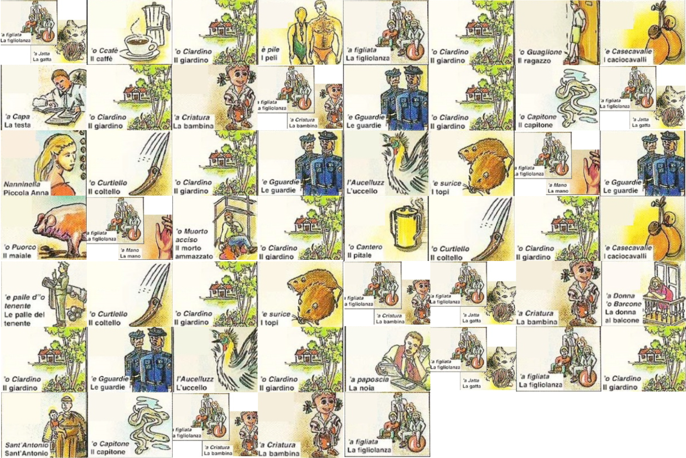

# A Lost Message

 

```txt
Once again, R-Boy has to discover where Zer0 went. Help him one more time to decrypt the space-time coordinates.
```

---

First we read `story.pdf`, which gave us the encrypted message: `0x727f00340e075a6b3a69146f2d3e3a67403c343e101d052b1a58623d3c1a0e53087c00245b6e00771d1f1005316e08693e24000714`

.. and there was also a `key.png`:



From the Text we found out three things. First there is a connection to the TV-Series called “Lost”. Secondly, the time span of **15 weeks and 3 days** must be important, because they changed it during the competition. Last but not least, the Key is something called **“Smorfia”**. Smorfia is basically matching images in your dreams with numbers. So that’s what we did, which gave us the following String: `09 03 42 51 59 09 51 15 88 34 51 02 09 02 24 51 32 09 03 26 41 51 24 35 11 09 05 24 04 09 05 62 51 27 41 51 88 30 41 51 11 09 02 09 03 02 43 51 24 35 51 40 09 03 09 51 13 32 09 02 02 09`

Now we pasted this String into CyberChef and used XOR with **6C** because 15w + 3d = 108 days = 0x6C → this resulted in the following: `eoF_We_c4N_nent_LeovE_tOgeitheiR_wE_4rE_geneonG_tO_Deoe_aLenne` - not very difficult to see is, that the first character should be i,I or 1 → so we just reversed the steps by doing `XOR(6C)` and `To Decimal` in CyberChef.

It turns out that 1 is equal to 93, after which we found our error. The double images were never supposed to be added/subtracted/etc. - they were meant to be representing one number. `09 03` now becomes `93` etc. => `1F_We_c4N_n0t_L1vE_tOg3th3R_wE_4rE_g01nG_tO_D1e_aL0ne`.. which is again a reference to Lost, because that’s a quote from Jack Shepard → therefore it matches again the story file we got.

The final steps were getting this quote as HEX representation and XORing it with the message `C9_ckX9_t6z_YavV6ykJ_z6_rk0bK_Qgz9_Ck_n0Bk_Zu_m6_h0iq`Now the last few lines of the story became important, because they included the hint, that we must use an ancient method to get the true message. After some trial and error we then got the flag by using ROT(20) `W9_weR9_n6t_SupP6seD_t6_le0vE_Kat9_We_h0Ve_To_g6_b0ck` - but as you can see, the numbers do not really match, since Caesar ciphers do NOT rotate numbers. So we just replaced it with the ones that would make sense and submitted the flag.

<center><b>{FLG:W3_weR3_n0t_SupP0seD_t0_le4vE_Kat3_We_h4Ve_To_g0_b4ck}</b></center>

