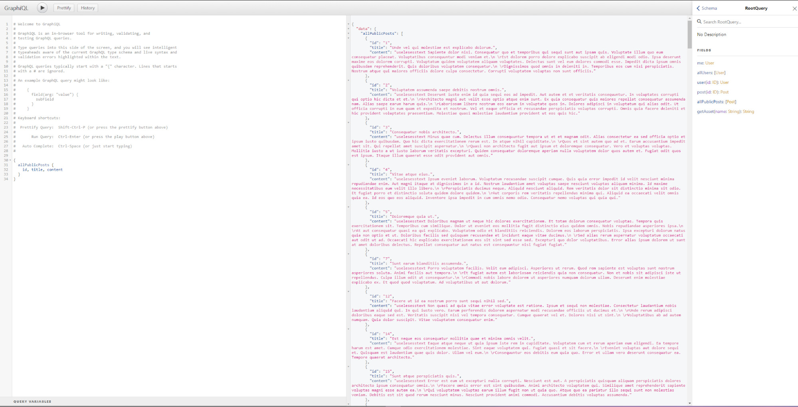
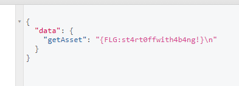

# Maze Graph

 

```txt
Now R-Boy can start his chase. He lands in 1230 BC during the reign of Ramses II. In the Valley of the Temples, Zer0 has plundered Nefertiti’s tomb to resell the precious treasures on the black market. By accident, the guards catch R-Boy near the tomb. To prove he’s not a thief, he has to show his devotion to the Pharaoh by finding a secret note.
http://gamebox1.reply.it/a37881ac48f4f21d0fb67607d6066ef7/
```

---

When first opening the Website, we see a screen telling us to go to `/graphql`. On there we looked at the Documentation Explorer and tried the field `allPublicPosts`...



... we noticed that the content always said “uselesesstext”, but the titles were rather interesting, because they were meaningful when translated - but since it were so many, we quickly stopped doing that. Then we noticed that a few IDs are missing among the posts. So we started taking notes of which posts are missing. We then remembered that there is a boolean in each post called `public` so we thought why not try using `post(id: ID)` for the missing (possibly NOT public) posts. Randomly trying the IDs we took note of earlier, we found an interesting post on the second attempt.


The title says “Personal notes” and the content said “Remember to delete the **../mysecretmemofile** asset.”From there it was pretty straightforward. There is a field called `getAsset(String: name)` in which we put the `../mysecretmemofile` and there was the Flag.




<center><b>{FLG:st4rt0ffwith4b4ng!}</b></center>

