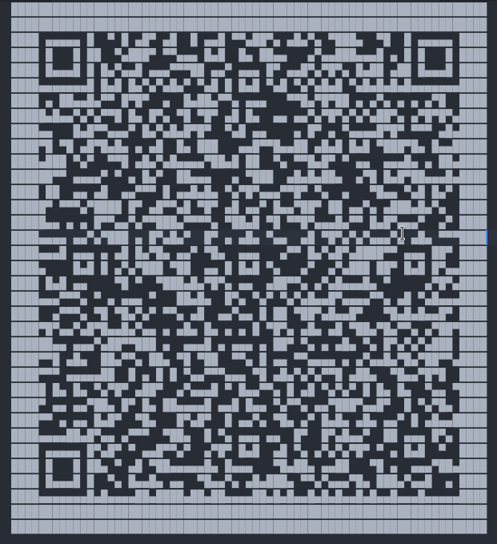

# POETA ERRANTE CHRONICLES

 

```txt
The space-time coordinates bring R-boy to Florence in 1320 AD. Zer0 has just stolen the unpublished version of the "Divine Comedy" from its real author, the "Wandering Poet", giving it to his evil brother, Dante.
Help the "Wandering Poet" recover his opera and let the whole world discover the truth.
gamebox1.reply.it, port 1320, Pwd: PoetaErranteIsMyHero!
```

---

After first connecting to the Server and playing the “game” we got the first Cipher: https://pastebin.com/qcDAMxf4 .. this looked like HEX, which is why we pasted it into CyberChef. And funny enough, we got something that looked like a QR-Code, but inverted. So we selected the QR and there it was, but sadly we could not scan it, because the line spacing was too big. So we copied it into VSCode and now look at that:



Scanning the QR got us this: Ludovico Arrosto Poetry Academy Via Vittorio Emanuele II, 21 Firenze Italy [l.arrosto@pacademy.com](mailto:l.arrosto@pacademy.com)This perfectly matched with the Question in the game, wanting to know where we want to go next. So we tried out different combinations until **”Via Vittorio Emanuele II”** worked. (And this makes sense, since it is a road in Italy)

The next Challenge was to “crack” a code. The hints we got were as follows:

```txt
3871	1 correct digit and in right position
4170	1 correct digit and in wrong position
5028	2 correct digits and in right position
7526	1 correct digit and in right position
8350	2 correct digits and in wrong position
```

By looking at this logically we knew that the code needed to look like one of these: **302x** or **x021**, so we quickly bute forced the last digit, since there are only 20 possibilities and in the end it was **3029**

Last but not least we got `hexdump.txt` → since it looked like a Hexdump, we pasted it into CyberChef and used “From Hexdump” and “Detect File Type” => it turned out to be a TCP Packet dump. So we imported the Hexdump into Wireshark and found out that there were some Packets with 1 Data Byte. After assembling those, we got this: {FLG:i74370prrn3343<} However, it was not the flag 😭 That’s why we thought, that we need to reorder the Flag, after which we got {FLG:i<3p03743rr4n73} - but it turned out to be also wrong, which is kinda weird since it perfectly matches the theme of this challenge. Finally after some time we found out that ONE Packet was out-of-order and after re-aligning it we finally had the Flag.

<center><b>{FLG:i7430prrn33743<}</b></center>

