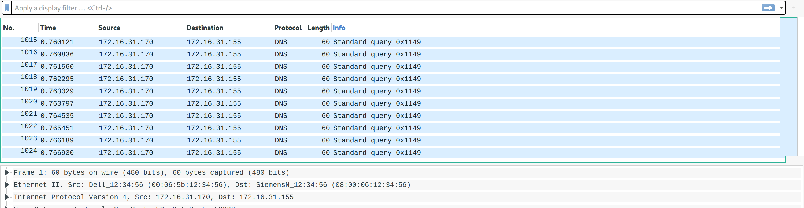

# DOS Attack

 

```txt
One customer of Senork Vertriebs GmbH reports that some older Siemens devices repeatedly crash. We looked into it and it seems that there is some malicious network traffic that triggers a DoS condition. Can you please identify the malware used in the DoS attack? We attached the relevant network traffic.
Flag format: syskronCTF{name-of-the-malware}
```

---

First, take a quick look at the provided _pcap_ file. See that it consists solely of DNS queries:



... now simply do a Google search for something like `siemens dos dns` - looking at the results you'll find several articles like [this one](https://www.securityweek.com/flaws-expose-siemens-protection-relays-dos-attacks) which inform you that the malware's name is in fact `Industroyer`.

The flag therefore was: `flag{Industroyer}`
