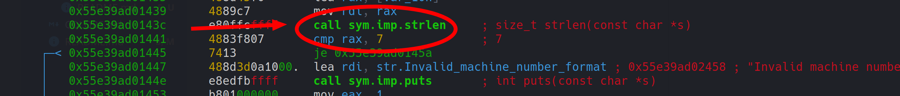
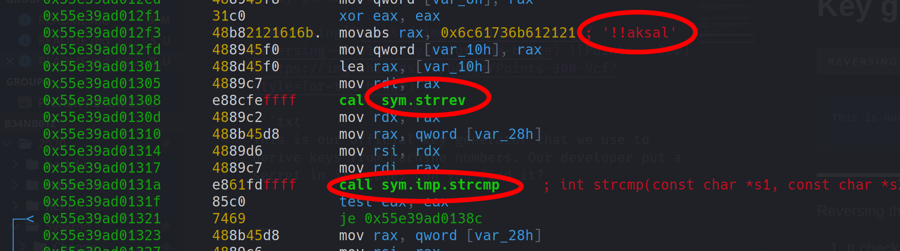

# Key generator

 

```txt
This is our official key generator that we use to derive keys from machine numbers. Our developer put a secret in its code. Can you find it?
```

---

Reversing the given binary you'll discover a couple of things:

1. It checks, whether or not the entered string has a length of `7` and stops/continues execution accordingly.



2. It compares the input string to the static string `laska!!`.



This is were it gets interesting:

* if the strings don't match, it'll just generate some random serial number according to this pattern:

```txt
inp[6]-6 + inp[5]-5 + inp[4]-4 + ... + inp[0]-0
```

* if the string do match, however, it calls the function `octal()` which prints the following:

```txt
1639171916391539162915791569103912491069173967911091119123955915191639156967955916396391439125916296395591439609104911191169719175

You are not done yet!
```

... _hmm_ ... actually, the last step isn't too difficult anymore ^^. The kind message tells us that we're not done yet... and... the name of the function that prints this gives us a good hint at what could possibly still be missing: `octal()`.

Simply split the weird long string at every `9` (since this obviously doesn't exist in octal) and decode the resulting string using the octal character codes:

```txt
163 171 163 153 162 157 156 103 124 106 173 67 110 111 123 55 151 163 156 67 55 163 63 143 125 162 63 55 143 60 104 111 116 71 175
```

... this gives us the flag: `syskronCTF{7HIS-isn7-s3cUr3-c0DIN9}`
