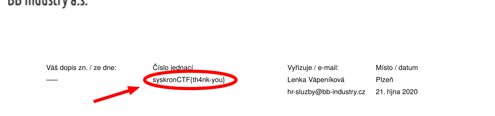

# Welcome Letter

 

```txt
Read the letter!
```

---

Actually... the task description is pretty precise about what you need to do ^^.



Near the top of the PDF file you'll be able to see the first flag: `syskronCTF{th4nk-you}`
