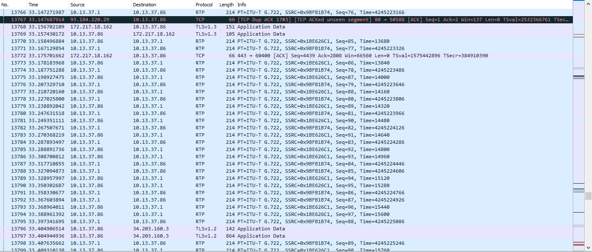
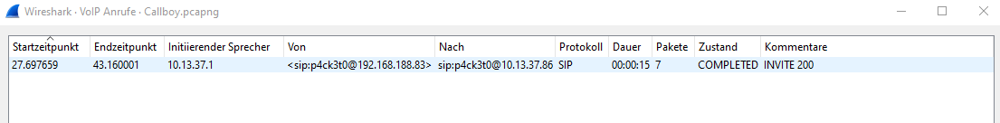
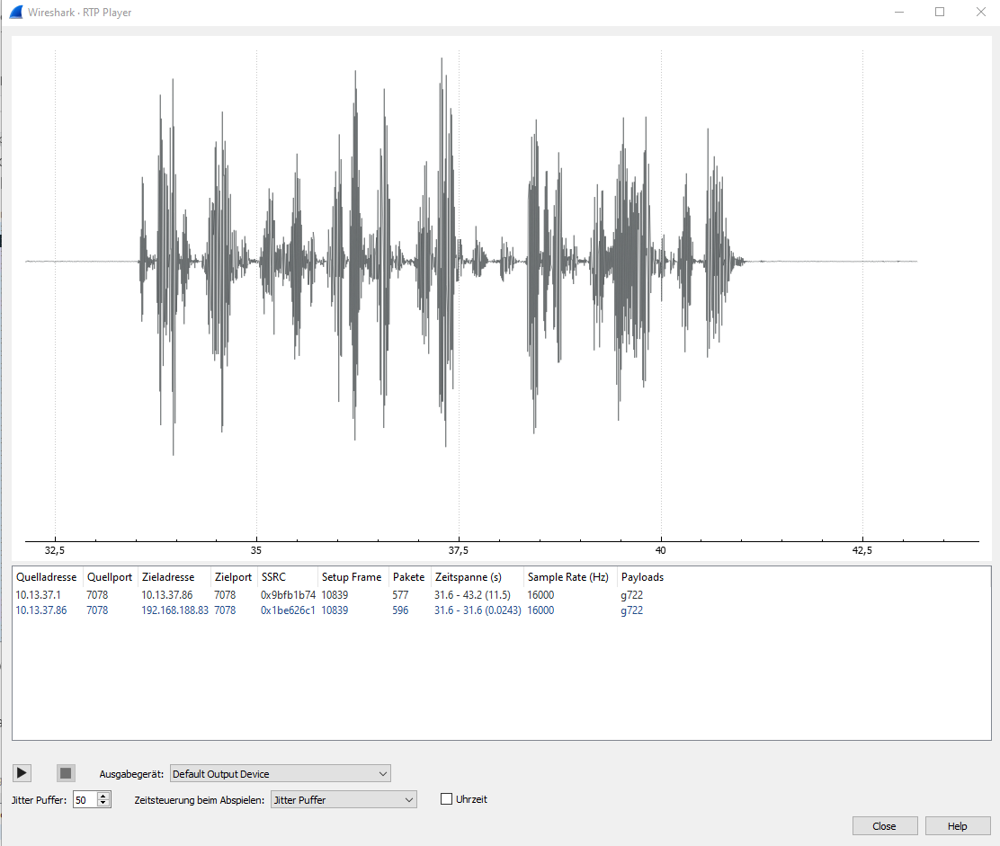

# Callboy

 

```txt
Have you ever called a Callboy? No!? Then you should definitely try it. To make it a pleasant experience for you, we have recorded a call with our Callboy to help you get started, so that there is no embarrassing silence between you.

PS: do not forget the to wrap flag{} around the secret
```

---

To get started, open the `Callboy.pcapng` in Wireshark. In there you will notice a Protocol called `RTP` - `Real-Time Transport Protocol`.  "[...]is a network protocol for delivering audio and video over IP networks. RTP is used in communication and entertainment systems that involve streaming media, such as telephony, video teleconference applications including WebRTC, television services and web-based push-to-talk features. [...]"



This made sense, since the description of the challenge implied, that there is a call, we have to listen to.  But how are we gonna get the audio from those packets?

[This](https://support.yeastar.com/hc/en-us/articles/360007606533-How-to-Analyze-SIP-Calls-in-Wireshark) website's second point "SIP Call analysis" tells us, how we are gonna do that. Following the instructions by clicking on "Telephony/Voip Calls" we get this window: 



.. as you can see, there is one call, which lasted 15 seconds. By selecting it and clicking on the play button in the bottom of the window, a nice window appears, where we can play the call.



Sadly enough, we can only play and stop the track, but not pause or resume it. By clicking on play, the flag reveals itself.

<p  align="center"><b>flag{call_me_baby_1337_more_times}</b></p>