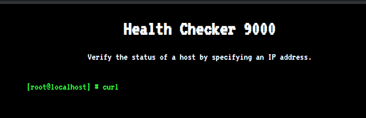
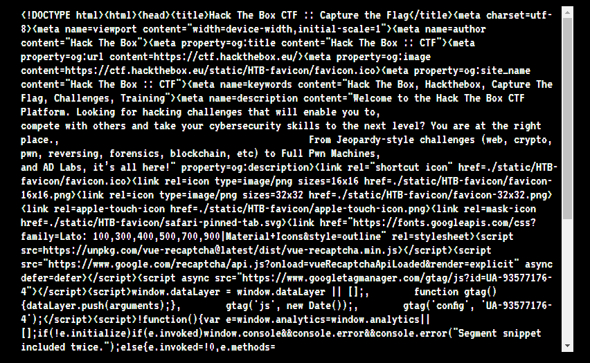
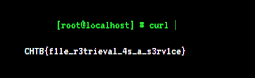

# Caas

 

```txt
cURL As A Service or CAAS is a brand new Alien application, built so that humans can test the status of their websites. However, it seems that the Aliens have not quite got the hang of Human programming and the application is riddled with issues.
This challenge will raise 43 euros for a good cause.
```

---

When opening the webpage, we get a little command prompt like input:



If we now enter a website link (e.g. https://ctf.hackthebox.eu), then we get the result of a little curl:



... so it seems to be a standard curl, so what if we just used `file:///flag`? 



Well, we get the flag 🤷‍♂️: `CHTB{f1le_r3trieval_4s_a_s3rv1ce}`
