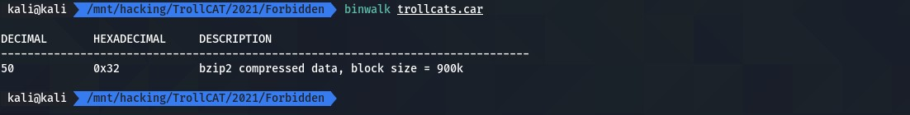

# Forbidden

 

```txt
Agent Troll recieved some file but not able to read the data. Can you help us?
```

---

A simple binwalk on the downloaded file will reveal that it contains a `bzip2` archive:

<div align="center">
    
</div>

... all you need to do now is extract it and get the flag:

```bash
binwalk -e ./trollcats.car
cat _trollcats.car.extracted/32
```

... the flag was: `Trollcat{M0zilla_Archive_maaaarls}`
